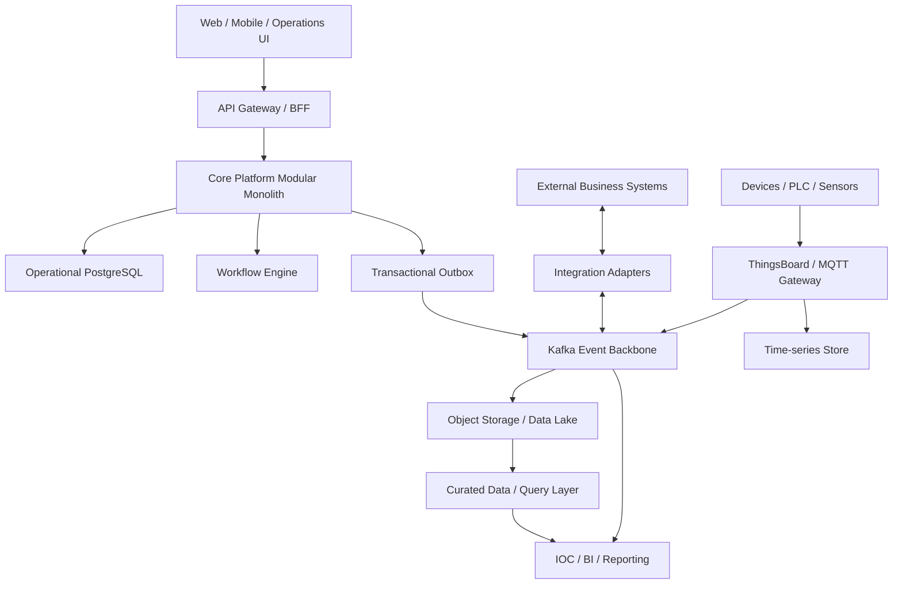

# Core Platform Architecture Standard

| Thuộc tính | Giá trị |
|---|---|
| Mã tài liệu | `CP-AS-001` |
| Phiên bản | `1.1.0` |
| Trạng thái | Proposed |
| Phạm vi | Core Platform và các module ERP, CRM, MES, IoT, Data Platform, IOC |
| Chủ sở hữu | Platform Architecture Team |
| Người phê duyệt | Chief Architect, Platform Engineering Lead, Security Lead |
| Chu kỳ rà soát | 6 tháng hoặc khi có thay đổi kiến trúc mức Major |

## 1. Mục đích

Tài liệu này quy định kiến trúc kỹ thuật bắt buộc cho Core Platform Framework và các hệ thống xây dựng trên nền tảng này.

Mục tiêu:

- Giữ Core Platform độc lập với nghiệp vụ cụ thể.
- Cho phép phát triển nhanh bằng metadata mà không đánh đổi tính đúng đắn của dữ liệu.
- Cô lập tenant theo nguyên tắc defense in depth.
- Bảo đảm sự kiện được phát tin cậy và có thể truy vết.
- Bắt đầu bằng modular monolith, chỉ tách microservice khi có bằng chứng.
- Chuẩn hóa API, dữ liệu, bảo mật, vận hành và quản trị thay đổi.

Tài liệu sử dụng các từ khóa:

- **MUST**: bắt buộc; vi phạm cần ADR ngoại lệ được phê duyệt.
- **MUST NOT**: bị cấm.
- **SHOULD**: khuyến nghị mạnh; nếu không áp dụng phải ghi rõ lý do.
- **MAY**: tùy chọn.

## 2. Phạm vi và ngoài phạm vi

### 2.1 Trong phạm vi

- Metadata Engine và Dynamic Data Engine.
- Generic API, Permission Engine, Hook System và Workflow integration.
- Module packaging và ranh giới module.
- Multi-tenancy, authentication, authorization và audit.
- Event backbone và tích hợp hệ thống ngoài.
- Operational database, telemetry store và Data Lake.
- Các tiêu chuẩn triển khai, quan sát, phục hồi và versioning.

### 2.2 Ngoài phạm vi

- Quy trình nghiệp vụ chi tiết của từng domain.
- Thiết kế giao diện người dùng cụ thể.
- Mô hình triển khai cloud/on-premise riêng của từng khách hàng.
- Cam kết SLO cụ thể của từng sản phẩm; tài liệu này chỉ quy định baseline.

## 3. Nguyên tắc kiến trúc

### P1. Core trung lập với domain

Core MUST NOT chứa entity hoặc quy tắc của ERP, CRM, MES hay domain khách hàng cụ thể.

Core MAY chứa capability kỹ thuật dùng chung:

- định danh, version và lifecycle của document;
- metadata, validation và reference;
- tenant context, authorization và audit;
- optimistic locking và idempotency;
- hook contract, event envelope và workflow binding.

### P2. Metadata-driven có giới hạn

Metadata SHOULD điều khiển schema logic, validation, API và UI form cho các entity phù hợp. Metadata MUST NOT được dùng để né tránh:

- constraint dữ liệu quan trọng;
- transaction boundary;
- type safety cần thiết;
- mô hình aggregate của domain;
- tối ưu truy vấn đã được chứng minh bằng đo lường.

### P3. Multi-tenant từ đầu

Mọi đường truy cập dữ liệu MUST có tenant context. Cô lập tenant MUST được thực hiện tại nhiều tầng: token, application, database, cache, event, object storage và observability.

### P4. Ranh giới module rõ ràng

Mỗi module sở hữu dữ liệu và public contract của mình. Module khác MUST NOT truy cập package nội bộ hoặc bảng thuộc quyền sở hữu của module đó.

### P5. Event đáng tin cậy

Thay đổi trạng thái nghiệp vụ quan trọng MUST tạo integration event qua Transactional Outbox. Consumer MUST idempotent.

### P6. Tiến hóa có kiểm soát

Kiến trúc mặc định là modular monolith. Microservice chỉ được tạo khi thỏa tiêu chí tại Mục 14 và có ADR được phê duyệt.

### P7. Secure and observable by default

Authentication, authorization, audit, metrics, logs và traces là thành phần bắt buộc, không phải công việc bổ sung sau MVP.

## 4. Kiến trúc tham chiếu



### 4.1 Luồng truy cập

- UI giao dịch MUST truy cập Core qua API Gateway/BFF hoặc public API.
- IOC/BI MUST NOT truy vấn trực tiếp operational database.
- Dữ liệu lịch sử MUST đi qua event pipeline hoặc ingestion contract được phê duyệt.
- MQTT được dùng ở biên thiết bị; Kafka là event backbone nội bộ mặc định.
- Không đưa Kafka trực tiếp ra trình duyệt. Real-time UI MUST dùng WebSocket/SSE gateway có authentication và authorization.

## 5. Kiến trúc nội bộ Core Platform

| Thành phần | Trách nhiệm | Quy định |
|---|---|---|
| Metadata Engine | DocType, field, validation và relationship | Metadata phải có version và migration |
| Data Engine | Persistence strategy và query | Chọn storage theo Mục 6; không mặc định mọi entity dùng JSONB |
| Generic API | CRUD/query chuẩn hóa | Tuân thủ Mục 8 |
| Permission Engine | Policy theo tenant, role, action và resource | CRUD chỉ là baseline |
| Hook System | Extension point nội bộ | Tuân thủ lifecycle và failure policy tại Mục 9 |
| Workflow Adapter | Kết nối BPMN engine | Core không tự xây workflow engine |
| Module Runtime | Discovery, compatibility và lifecycle | Module phải khai báo manifest/version |
| Audit Service | Security và business audit | Append-only, có retention policy |
| Outbox Publisher | Phát integration event | Cùng transaction với thay đổi nghiệp vụ |

## 6. Chiến lược dữ liệu

### 6.1 Phân loại storage

Mỗi DocType MUST chọn đúng một persistence strategy trong thiết kế ban đầu:

| Strategy | Dùng cho | Không dùng cho |
|---|---|---|
| Generic JSONB | Form động, custom field, cấu hình, dữ liệu lưu lượng thấp | Ledger, tồn kho, dữ liệu cần constraint/join phức tạp |
| Relational aggregate | Giao dịch nghiệp vụ quan trọng, dữ liệu cần FK/unique/check constraint | Telemetry tốc độ cao |
| Time-series | Telemetry, metric theo thời gian | Master data và transaction ERP |
| Object storage | Raw event, file lớn, lịch sử phân tích | Truy vấn giao dịch đồng bộ |

Quyết định storage MUST dựa trên:

- transaction và consistency requirement;
- query pattern và volume;
- constraint và relationship;
- retention và archival;
- latency, throughput và khả năng phục hồi.

### 6.2 Quy định JSONB

- Bản ghi generic MUST có tối thiểu: `id`, `tenant_id`, `doc_type`, `schema_version`, `data`, `status`, `version`, `created_at`, `created_by`, `updated_at`, `updated_by`.
- Query field MUST nằm trong allowlist metadata; không cho client truyền JSON path tùy ý.
- Index MUST được tạo từ query thực tế, không tạo GIN toàn cục như giải pháp mặc định.
- Constraint quan trọng không thể biểu diễn an toàn bằng JSONB MUST chuyển entity sang relational strategy.
- Metadata schema change MUST có migration, compatibility check và rollback plan.

### 6.3 Ownership và transaction

- Một bảng hoặc aggregate chỉ có một module owner.
- Module khác chỉ đọc/ghi qua public interface hoặc event.
- Transaction không được trải qua network call.
- Giao dịch quan trọng MUST dùng optimistic locking hoặc locking strategy được mô tả rõ.

## 7. Multi-tenancy và bảo mật

### 7.1 Tenant context

- Production MUST lấy tenant identity từ JWT đã xác thực hoặc trusted service identity.
- MUST NOT nhận `tenant_id` có thẩm quyền từ header, query hoặc request body của client.
- Dev-only tenant header MUST bị vô hiệu hóa bằng cấu hình fail-closed ngoài development profile.
- Background job và event consumer MUST thiết lập tenant context tường minh.

### 7.2 Authentication

Baseline identity provider là Keycloak sử dụng OAuth 2.0/OIDC.

Resource server MUST kiểm tra:

- chữ ký và thuật toán cho phép;
- `iss`, `aud`, `exp`, `nbf`;
- client/authorized party phù hợp;
- tenant membership và trạng thái người dùng.

### 7.3 Authorization

Permission model tối thiểu:

```text
Tenant + Subject + Resource Type + Resource Instance + Action + Context
```

Action MAY gồm `create`, `read`, `update`, `delete`, `approve`, `transition`, `assign`, `export` và action domain-specific.

Policy MUST hỗ trợ khi cần:

- role-based access;
- record ownership;
- organizational scope;
- field-level protection;
- workflow-state authorization;
- segregation of duties.

### 7.4 Database isolation

- Shared-schema deployment MUST bật PostgreSQL Row-Level Security cho bảng tenant-owned.
- Application MUST đặt tenant context trong transaction bằng cơ chế không thể bị client ghi đè.
- Database role của ứng dụng MUST NOT có quyền bypass RLS.
- Migration và administrative access MUST dùng role riêng và được audit.

### 7.5 Tenant-aware infrastructure

- Cache key MUST chứa tenant identifier.
- Event envelope và partition key MUST chứa tenant identifier phù hợp.
- Object path/bucket policy MUST cô lập tenant.
- Log không được lộ secret, token hoặc dữ liệu nhạy cảm; tenant ID phải có để điều tra nhưng phải tuân thủ data classification.

### 7.6 Kiểm thử bắt buộc

Mỗi module MUST có automated negative tests chứng minh tenant A không thể đọc, sửa hoặc xóa tài nguyên tenant B qua:

- API theo ID;
- search/filter;
- bulk API;
- export;
- event consumer;
- background job.

## 8. API Standard

### 8.1 Contract

Generic resource baseline:

```text
POST   /api/v1/resources/{docType}
GET    /api/v1/resources/{docType}/{id}
PATCH  /api/v1/resources/{docType}/{id}
DELETE /api/v1/resources/{docType}/{id}
GET    /api/v1/resources/{docType}
```

- Public API MUST được mô tả bằng OpenAPI.
- Request/response MUST được validate theo metadata version.
- Server MUST dùng allowlist cho field, filter, sort và include.
- List API MUST có pagination ổn định; cursor pagination SHOULD được dùng cho tập dữ liệu lớn.
- Update MUST hỗ trợ optimistic concurrency qua version hoặc ETag/`If-Match`.
- Create và command có thể retry MUST hỗ trợ idempotency key.
- Bulk operation MUST có giới hạn kích thước và semantics lỗi rõ ràng.
- API MUST áp dụng request-size limit, rate limit và query-complexity limit.

### 8.2 Error envelope

```json
{
  "type": "https://errors.example.com/validation-failed",
  "title": "Validation failed",
  "status": 400,
  "code": "DOCUMENT_VALIDATION_FAILED",
  "detail": "One or more fields are invalid",
  "instance": "/api/v1/resources/Invoice/123",
  "correlationId": "01H...",
  "errors": []
}
```

Error response MUST NOT chứa stack trace hoặc internal SQL detail.

### 8.3 Versioning

- Breaking change MUST tạo API major version mới hoặc có migration window được phê duyệt.
- Additive optional field là backward-compatible.
- Xóa/đổi nghĩa field hoặc siết validation là breaking change.
- Deprecated API MUST có owner, usage telemetry và sunset date.

## 9. Hook và workflow

### 9.1 Hook lifecycle

| Hook | Thời điểm | Quy định |
|---|---|---|
| `beforeValidate` | Trước validation | Pure/deterministic, không I/O mạng |
| `afterValidate` | Sau validation | Không thay đổi dữ liệu ngoài aggregate |
| `beforeCommit` | Trong transaction | Nhanh, bounded, không gọi remote service |
| `afterCommit` | Sau commit | Chỉ enqueue/phát event; xử lý nặng bất đồng bộ |

- Hook MUST có ordering rõ ràng.
- Hook MUST có timeout và failure policy.
- Hook MUST NOT truy cập repository nội bộ của module khác.
- Logic cần remote call MUST chạy bất đồng bộ sau commit.
- Hook execution MUST tạo trace và metric.

### 9.2 Workflow engine

Baseline cho phiên bản này là **Flowable**, tích hợp qua Workflow Adapter. Thay đổi engine cần ADR.

- BPMN definition MUST được version control.
- Workflow instance MUST lưu liên kết tới tenant, document ID và document version.
- User task MUST kiểm tra lại authorization tại thời điểm claim/complete.
- Retry, incident, timeout và compensation MUST được định nghĩa.
- Không được sửa in-place definition đang có instance chạy nếu thay đổi không tương thích.

## 10. Event Standard

### 10.1 Transactional Outbox

Thay đổi aggregate và outbox record MUST được commit trong cùng database transaction.

Outbox publisher MAY dùng polling hoặc CDC, nhưng MUST:

- retry có backoff;
- không làm mất event;
- cung cấp metric lag và publish failure;
- lưu trạng thái đủ để vận hành và replay có kiểm soát.

### 10.2 Event envelope

```json
{
  "eventId": "uuid",
  "eventType": "invoice.approved",
  "eventVersion": 1,
  "occurredAt": "2026-08-13T10:00:00Z",
  "tenantId": "tenant-id",
  "aggregateType": "Invoice",
  "aggregateId": "invoice-id",
  "aggregateVersion": 12,
  "correlationId": "uuid",
  "causationId": "uuid",
  "producer": "erp-module",
  "data": {}
}
```

### 10.3 Delivery contract

- Baseline là at-least-once delivery.
- Consumer MUST idempotent theo `eventId` hoặc business idempotency key.
- Ordering chỉ được bảo đảm trong phạm vi partition key đã công bố.
- Poison message MUST đi vào dead-letter flow có alert và runbook.
- Event schema MUST có compatibility check trong CI.
- Event chứa PII/secret MUST tuân thủ data classification và retention.
- Replay production MUST cần phê duyệt và audit.

### 10.4 Event naming

- Domain event dùng thì quá khứ: `invoice.approved`, `work-order.started`.
- Command không được giả dạng event.
- Không dùng event mơ hồ như `document.updated` nếu consumer cần ý nghĩa nghiệp vụ cụ thể.

## 11. Integration và IoT

- Apache Camel là baseline cho adapter kết nối hệ thống nghiệp vụ ngoài.
- Adapter MUST chống retry storm, có timeout, circuit breaker và idempotency.
- Canonical model chỉ được tạo khi có nhiều integration thực sự dùng chung; không ép mọi hệ thống vào một mô hình khổng lồ.
- MQTT dùng cho device connectivity; dữ liệu đã chuẩn hóa đi vào Kafka hoặc time-series store theo data contract.
- Device identity, certificate/credential rotation và revocation MUST được quản lý.
- Telemetry MUST có timestamp nguồn, timestamp ingest, device ID, tenant ID, quality indicator và schema version.

## 12. Data Platform và IOC

### 12.1 Các giai đoạn

1. **Operational analytics foundation:** Kafka, time-series store và lưu raw immutable event vào object storage.
2. **Lakehouse foundation:** object storage + một table format được chọn bằng ADR.
3. **Curated data products:** Bronze/Silver/Gold, catalog, quality checks và ownership.
4. **IOC/BI:** query curated data và real-time stream qua service được kiểm soát.

### 12.2 Quy định

- Core database là system of record cho operational state.
- Data Platform là system of record cho lịch sử phân tích đã ingest.
- Data Lake MUST NOT ghi ngược vào Core ngoài command/API được phê duyệt.
- Mỗi dataset MUST có owner, schema, classification, retention và quality SLA.
- Raw layer MUST immutable; correction được biểu diễn bằng record/version mới.
- IOC MUST xác định freshness và trạng thái stale cho từng widget.

## 13. Technology Baseline

| Capability | Baseline | Ghi chú |
|---|---|---|
| Runtime | Java 21, Spring Boot 3.x | Pin phiên bản trong BOM của platform |
| Modular architecture | Spring Modulith, ArchUnit | Kiểm tra boundary trong CI |
| Operational database | PostgreSQL | JSONB và relational theo Mục 6 |
| Identity provider | Keycloak | OAuth 2.0/OIDC |
| Workflow | Flowable | Tích hợp qua adapter |
| Event backbone | Apache Kafka | Không dùng trực tiếp từ browser/device |
| Device connectivity | ThingsBoard/MQTT gateway | Tách khỏi business event backbone |
| Integration | Apache Camel | Adapter theo hệ thống ngoài |
| Time-series | TimescaleDB | Operational telemetry/query ngắn hạn |
| Object storage | S3-compatible storage | Cloud S3 hoặc MinIO tùy deployment |
| Table format | Chọn bằng ADR trước giai đoạn lakehouse | Không vận hành song song hai format nếu không có nhu cầu |
| Query/orchestration | Chọn theo workload bằng ADR | Chỉ triển khai khi có owner và SLO |

Technology baseline không đồng nghĩa mọi deployment phải chạy toàn bộ stack. Thành phần chỉ được đưa vào khi có use case, owner, SLO, backup và runbook.

## 14. Modular monolith và tiêu chí tách microservice

Một module chỉ được đề xuất tách khi có ít nhất một driver mạnh và không thể giải quyết hợp lý trong monolith:

- cần scale độc lập đã được đo lường;
- yêu cầu availability/failure isolation khác biệt;
- release cadence và ownership độc lập;
- security/compliance boundary riêng;
- workload hoặc runtime khác biệt đáng kể.

Trước khi tách MUST có:

- module boundary và owner ổn định;
- public API/event contract được version hóa;
- dữ liệu thuộc sở hữu riêng;
- kế hoạch transaction/consistency;
- SLO, dashboard, alert, runbook và on-call owner;
- migration, rollback và cost estimate;
- ADR được Chief Architect và Platform Engineering Lead phê duyệt.

## 15. Non-functional baseline

Mỗi sản phẩm/module MUST công bố:

- availability SLO;
- latency SLI theo endpoint/operation quan trọng;
- throughput và concurrency target;
- RPO và RTO;
- retention và archival;
- maximum payload/document size;
- data classification;
- dependency timeout và retry budget.

Không được sử dụng các từ “high availability”, “real-time” hoặc “large scale” nếu không có ngưỡng đo cụ thể.

## 16. Observability và audit

- Mọi request/event MUST có correlation ID.
- Service MUST phát structured logs, metrics và distributed traces.
- Metric tối thiểu: request rate, error rate, latency, saturation, outbox lag, consumer lag, DLQ count và workflow incident.
- Audit log MUST ghi actor, tenant, action, resource, thời điểm, outcome và nguồn truy cập.
- Audit log MUST append-only và có retention/access policy.
- Alert MUST gắn với SLO hoặc hành động vận hành cụ thể; không alert chỉ vì metric tồn tại.

## 17. Resilience, backup và disaster recovery

- Remote call MUST có timeout; retry chỉ dùng với operation an toàn/idempotent.
- Retry MUST có exponential backoff và jitter.
- Circuit breaker SHOULD dùng cho dependency có failure mode kéo dài.
- Backup MUST mã hóa, có retention và tách failure domain phù hợp.
- Restore test MUST chạy định kỳ và chứng minh đạt RPO/RTO.
- Kafka, database, object storage và workflow state MUST có kế hoạch phục hồi nhất quán.
- Disaster recovery exercise MUST có biên bản và corrective actions.

## 18. CI/CD và quality gates

Pipeline tối thiểu MUST có:

1. Compile và unit test.
2. Static analysis và dependency vulnerability scan.
3. Architecture boundary test bằng ArchUnit/Spring Modulith.
4. API/event schema compatibility test.
5. Database migration validation.
6. Tenant-isolation integration test.
7. Container/IaC scan nếu có.
8. Integration và smoke test.
9. Artifact signing/SBOM theo yêu cầu môi trường.
10. Deployment có rollback hoặc roll-forward plan.

Production deployment MUST yêu cầu approval của service owner; thay đổi security boundary, data model nền tảng hoặc public contract cần thêm approver tương ứng.

## 19. Versioning và migration

- Core Platform và module dùng Semantic Versioning.
- Module manifest MUST khai báo dải phiên bản Core tương thích.
- Metadata, database schema, API, event và BPMN MUST được version độc lập.
- Migration MUST forward-compatible trong rolling deployment.
- Expand-and-contract SHOULD được dùng cho breaking database change.
- Mỗi migration dữ liệu lớn MUST có dry run, progress metric, restart strategy và rollback/compensation plan.
- Không sửa Core cho một khách hàng; customization đi qua metadata, hook, policy hoặc extension service có contract.

## 20. Architecture governance

ADR là bắt buộc khi:

- thêm hoặc thay thế công nghệ nền tảng;
- tạo microservice mới;
- thay đổi ownership dữ liệu;
- tạo ngoại lệ multi-tenant/security;
- tạo synchronous dependency xuyên module/service;
- thay đổi public API/event theo cách breaking;
- ghi ngược từ Data Platform vào Core.

ADR MUST gồm: context, decision, alternatives, consequences, security impact, operational cost, migration và approvers.

Ngoại lệ tiêu chuẩn MUST có:

- phạm vi rõ ràng;
- owner chịu trách nhiệm;
- đánh giá rủi ro;
- biện pháp giảm thiểu;
- ngày hết hạn;
- người phê duyệt.

## 21. Quy trình thêm module mới

1. Xác định bounded context, owner và dữ liệu sở hữu.
2. Phân loại entity và chọn persistence strategy.
3. Khai báo DocType/relational aggregate và migration.
4. Định nghĩa authorization policy và tenant tests.
5. Định nghĩa public API, domain event và integration event.
6. Đăng ký module qua Spring Modulith và kiểm tra boundary.
7. Thiết kế hook/workflow nếu cần.
8. Công bố SLO, dashboard, alert và runbook.
9. Hoàn tất threat assessment và data classification.
10. Qua Definition of Done tại Mục 22.

## 22. Definition of Done

Một module chỉ hoàn thành thiết kế kỹ thuật khi trả lời **Có** cho toàn bộ mục áp dụng:

### Architecture

- [ ] Bounded context, owner và public contract đã được xác định.
- [ ] Không có domain code trong package nội bộ của Core.
- [ ] ArchUnit/Spring Modulith test ngăn truy cập trái phép xuyên module.
- [ ] Persistence strategy có lý do và phù hợp Mục 6.
- [ ] Không có shared-table write từ module không sở hữu dữ liệu.

### API và dữ liệu

- [ ] OpenAPI và error contract đã được công bố.
- [ ] Pagination, concurrency, idempotency và query limits đã được xử lý.
- [ ] Database/metadata migration có compatibility và rollback plan.
- [ ] Constraint quan trọng được cưỡng chế tại tầng phù hợp.

### Security và tenant

- [ ] Authentication và authorization được kiểm tra ở server.
- [ ] RLS hoặc isolation strategy tương đương đã bật.
- [ ] Negative tenant-isolation tests chạy tự động.
- [ ] Cache, event, storage, log và background job đều tenant-aware.
- [ ] Audit và data classification đã hoàn tất.

### Event và workflow

- [ ] Integration event dùng Transactional Outbox.
- [ ] Consumer idempotent và có DLQ/runbook.
- [ ] Event schema có version và compatibility test.
- [ ] Hook không gọi remote service trong transaction.
- [ ] Workflow có version, authorization và incident handling.

### Operations

- [ ] SLI/SLO, RPO/RTO và capacity target đã được công bố.
- [ ] Dashboard, alert, log, metric và trace đã sẵn sàng.
- [ ] Backup/restore và failure scenarios đã được kiểm thử phù hợp rủi ro.
- [ ] Runbook và service owner/on-call owner đã được xác định.

## 23. Lộ trình khuyến nghị

### Giai đoạn 1 — Platform foundation

- Core lớp metadata, persistence, API, permission, hook và module runtime.
- PostgreSQL RLS, audit và tenant isolation tests.
- Transactional Outbox và event envelope.
- Một module tham chiếu chứng minh cả JSONB và relational strategy.

**Exit criteria:** không có lỗi cross-tenant; outbox không mất event trong failure test; module boundary test chạy trong CI.

### Giai đoạn 2 — Identity và workflow

- Keycloak production integration.
- Flowable adapter và BPMN lifecycle.
- API contract, rate limit, idempotency và observability hoàn chỉnh.

**Exit criteria:** authentication/authorization test, workflow recovery test và API compatibility test đạt.

### Giai đoạn 3 — Domain expansion

- ERP/CRM trước; MES sau khi generic model được chứng minh.
- IoT gateway và time-series foundation khi có thiết bị thực.

**Exit criteria:** capacity test theo tải dự kiến và domain invariants được cưỡng chế.

### Giai đoạn 4 — Data foundation

- Kafka ingestion, raw immutable object storage và TimescaleDB cho operational telemetry.
- Data quality, ownership, retention và replay procedure.

### Giai đoạn 5 — Lakehouse và IOC

- Chọn table format/query engine bằng ADR dựa trên workload.
- Bronze/Silver/Gold và curated data products.
- IOC hiển thị freshness/staleness và không truy vấn operational database.

## 24. Success criteria cấp nền tảng

Ba tiêu chí tối thiểu trước khi tuyên bố Core Platform production-ready:

1. **Tenant isolation:** 100% automated cross-tenant negative tests đạt trên API, query, bulk, event và background job.
2. **Event reliability:** failure-injection test chứng minh transaction đã commit luôn tạo outbox record; consumer retry không tạo side effect trùng lặp.
3. **Evolvability:** một module tham chiếu nâng metadata/database/API qua rolling deployment mà không downtime và không breaking consumer hiện hữu.

## 25. Approver chain

| Quyết định | Approver bắt buộc |
|---|---|
| Kiến trúc nền tảng, module boundary, microservice extraction | Chief Architect |
| Runtime, CI/CD, observability, SLO và vận hành | Platform Engineering Lead |
| Authentication, authorization, tenant isolation và data classification | Security Lead |
| Schema/domain invariant và data ownership | Domain Lead + Data Architect |
| Production release | Service Owner |

Không tác nhân tự động nào được tự phê duyệt quyết định production.

## Phụ lục A — Mẫu module manifest

```yaml
name: erp-sales
version: 1.2.0
coreCompatibility: ">=1.1.0 <2.0.0"
owner: erp-team
dataClassification: confidential
doctypes:
  - SalesOrder
publicInterfaces:
  - sales-order-api
publishedEvents:
  - sales-order.confirmed.v1
consumedEvents:
  - customer.credit-updated.v1
```

## Phụ lục B — Mẫu ADR tối thiểu

```markdown
# ADR-NNN: Tên quyết định

Status: Proposed | Accepted | Deprecated | Superseded
Owners:
Approvers:
Date:

## Context
## Decision
## Alternatives considered
## Consequences
## Security and tenant impact
## Operational cost and SLO impact
## Migration and rollback
## Expiry/review date
```

## Phụ lục C — Open issues trước khi chuyển trạng thái Accepted

- [ ] Xác nhận Flowable là workflow baseline theo yêu cầu license và vận hành.
- [ ] Chốt PostgreSQL RLS session-context implementation.
- [ ] Chốt event schema registry và compatibility mode.
- [ ] Chốt retention cho outbox, audit, Kafka và raw object storage.
- [ ] Định nghĩa SLO/RPO/RTO theo từng deployment tier.
- [ ] Gán tên người thật cho các vai trò approver ở Mục 25.
