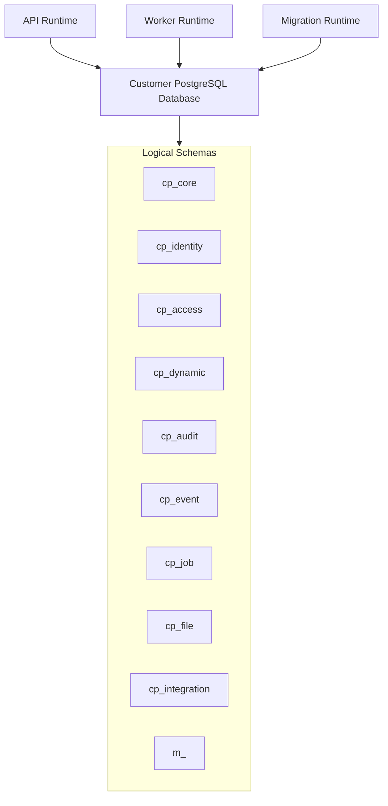
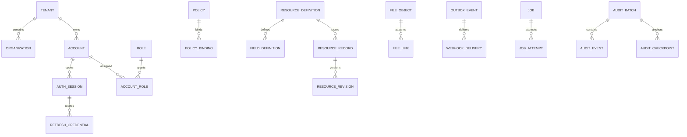

# Java Core Platform — Database Architecture & Data Design Standard

| Thuộc tính | Giá trị |
|---|---|
| Mã tài liệu | `CP-DATA-003` |
| Phiên bản | `1.0.0` |
| Trạng thái | Approved |
| Ngày lập | 2026-08-15 |
| Đầu vào | `CP-BA-001` Approved; `CP-ARCH-002` Approved for Database Design |
| Database baseline | PostgreSQL |
| Phạm vi | Logical/physical data architecture, schema ownership, RLS, index, lifecycle và recovery |
| Ngoài phạm vi | Domain-specific ERP/CRM/MES tables và production migration scripts |

## 1. Mục đích

Tài liệu này định nghĩa cơ sở dữ liệu nền tảng cho Java Core Platform. Thiết kế phải hỗ trợ:

- modular monolith với ownership dữ liệu rõ ràng;
- mỗi khách hàng một database/deployment;
- tenant context để hỗ trợ nhiều đơn vị và SaaS tương lai;
- code-first Domain Model và Dynamic Resource tách biệt;
- transaction-bound audit và outbox;
- local identity, permission, job, file và webhook;
- deployment từ Pilot đến Critical;
- chuyển giao source và tái tạo database độc lập.

Tài liệu không định nghĩa bảng nghiệp vụ như đơn hàng, hóa đơn hoặc thiết bị. Các bảng đó thuộc domain module tương ứng và phải tuân thủ chuẩn tại đây.

## 2. Bảy quyết định đã chốt

### ADR-DATA-001 — Token và session

**Decision:** Access token có thời hạn ngắn. Refresh/session credential là chuỗi opaque ngẫu nhiên, rotate sau mỗi lần sử dụng, database chỉ lưu hash. Credential family hỗ trợ phát hiện reuse và revoke toàn bộ family.

**Rationale:** Không lưu refresh token rõ; có thể revoke theo thiết bị/session; không buộc mọi deployment có external identity provider.

### ADR-DATA-002 — Password hashing

**Decision:** Argon2id là baseline. Mỗi password hash lưu algorithm và parameters. Cost được benchmark trên deployment, không thấp hơn security baseline; đăng nhập thành công có thể rehash khi policy tăng.

**Initial floor:** `m >= 19456 KiB`, `t >= 2`, `p >= 1`. Security Lead có thể nâng nhưng không hạ nếu không có ADR ngoại lệ.

### ADR-DATA-003 — Dynamic Resource storage

**Decision:** Một shared `resource_record` table lưu common typed columns và JSONB payload. Không tạo table runtime cho mỗi definition. Index động được tạo qua approved `resource_index_definition`, dùng partial/expression index theo resource type.

**Guardrail:** Aggregate critical không được đưa vào kho này.

### ADR-DATA-004 — Outbox, inbox và job

**Decision:** Dùng logical schema/table riêng nhưng cùng PostgreSQL deployment ở baseline. Không gộp thành một generic queue table.

### ADR-DATA-005 — File storage

**Decision:** Database chỉ lưu metadata. Development/Pilot có thể dùng filesystem adapter nếu có off-host backup. Standard/Critical dùng S3-compatible object storage.

### ADR-DATA-006 — Audit tamper evidence

**Decision:** Audit table append-only, application role không có UPDATE/DELETE. Audit được hash-chain theo batch; checkpoint định kỳ được ký hoặc lưu ngoài database/object storage có retention lock khi hạ tầng hỗ trợ.

### ADR-DATA-007 — Search

**Decision:** PostgreSQL full-text search và `pg_trgm` là baseline. External search chỉ được thêm sau benchmark hoặc yêu cầu hợp đồng.

## 3. Data architecture principles

### DP-01 — Module owns data

Một table có đúng một owner module. Module khác không được đọc/ghi table đó trực tiếp.

### DP-02 — Shared database, separate schemas

Mỗi platform/standard/domain module sở hữu PostgreSQL schema riêng. Tách schema nhằm:

- thể hiện ownership;
- giới hạn GRANT;
- quản lý migration theo module;
- tránh trùng tên;
- chuẩn bị tách service nếu thực sự cần.

Tách schema không tự tạo security boundary hoàn chỉnh; vẫn phải có application/module contract và architecture tests.

### DP-03 — Tenant everywhere it matters

Mọi row thuộc khách hàng/đơn vị phải có `tenant_id NOT NULL`, kể cả khi hiện tại một database chỉ phục vụ một khách hàng.

### DP-04 — Database enforces invariants

NOT NULL, UNIQUE, CHECK, FK và RLS phải được dùng cho invariant có thể cưỡng chế an toàn. Không chỉ dựa vào validation Java.

### DP-05 — No cross-module write

Foreign key xuyên module chỉ được dùng với kernel-owned stable identity và có ADR. Domain module không tạo FK trực tiếp vào bảng nội bộ của domain module khác.

### DP-06 — Append, version and archive

Audit/outbox/history thiên về append-only. Xóa dữ liệu phải có lifecycle, retention và legal hold; không dùng hard delete tùy ý.

### DP-07 — Online evolution

Migration production dùng expand-and-contract. Application N và N-1 phải cùng chạy được trong rolling window của Standard/Critical.

## 4. Database topology



## 5. PostgreSQL schema catalog

| Schema | Owner | Trách nhiệm |
|---|---|---|
| `cp_core` | Platform Kernel | tenant, organization, module, resource registry, idempotency và naming |
| `cp_identity` | Local Identity module | account, password, session, refresh credential, MFA |
| `cp_access` | Permission module | role, membership, policy và binding |
| `cp_dynamic` | Dynamic Resource module | definition, field, record, revision và index metadata |
| `cp_audit` | Audit module | business/security audit, batch và checkpoint |
| `cp_event` | Event module | outbox, inbox, dead letter và publication state |
| `cp_job` | Job module | job, attempt, trigger, lease và dead job |
| `cp_file` | File module | object metadata, upload, attachment, scan và deletion |
| `cp_integration` | Integration module | webhook endpoint, delivery và secret reference |
| `m_<module>` | Domain module | typed aggregate, projection và module history |

## 6. Naming, types và column conventions

### 6.1 Naming

- Schema/table/column/index/constraint: `snake_case`.
- Primary key constraint: `pk_<table>`.
- Foreign key: `fk_<table>__<ref_table>`.
- Unique: `uq_<table>__<columns>`.
- Check: `ck_<table>__<rule>`.
- Index: `ix_<table>__<purpose>`.
- RLS policy: `rls_<table>__tenant`.

Identifier phải ≤ PostgreSQL identifier limit; migration lint kiểm tra collision sau truncation.

### 6.2 Common types

| Khái niệm | PostgreSQL type | Quy định |
|---|---|---|
| Technical ID | `uuid` | UUIDv7 tạo ở application; v4 chấp nhận cho security random token ID |
| Tenant ID | `uuid` | `NOT NULL` với tenant-owned row |
| Time | `timestamptz` | Lưu UTC; timezone hiển thị ở application |
| Version | `bigint` | Optimistic lock, bắt đầu 0 hoặc 1 và nhất quán theo module |
| Enum ổn định | `varchar` + CHECK | Tránh PostgreSQL enum nếu cần đổi online thường xuyên |
| Arbitrary metadata | `jsonb` | Có schema/size/query guardrail |
| Hash/checksum | `bytea` | Không lưu hex nếu không cần đọc thủ công |
| IP | `inet` | Security audit/login |
| Monetary | Domain-owned `numeric(p,s)` | Core không đặt một precision cho mọi ngành |

### 6.3 Common tenant-owned columns

```text
id              uuid primary key
tenant_id       uuid not null
version         bigint not null
created_at      timestamptz not null
created_by      uuid null
updated_at      timestamptz not null
updated_by      uuid null
archived_at     timestamptz null
```

Không bắt buộc mọi bảng append-only có `updated_*` hoặc `archived_at`; chỉ dùng column có ý nghĩa.

### 6.4 Time and ordering

- Không dùng timestamp làm primary key.
- Ordering ổn định dùng `(created_at, id)` hoặc cursor chuyên biệt.
- Database clock là nguồn commit/audit timestamp; client time chỉ lưu ở field riêng có nguồn.

## 7. Database roles và privilege model

| Role | Quyền |
|---|---|
| `cp_owner` | Sở hữu schema/object; không dùng cho runtime |
| `cp_migrator` | DDL/migration có kiểm soát; không dùng cho API |
| `cp_app` | DML qua schema/table được cấp; không BYPASSRLS, không owner |
| `cp_worker` | DML job/outbox và module handler cần thiết; không BYPASSRLS |
| `cp_readonly_ops` | Read projection/monitoring được allowlist; RLS vẫn áp dụng |
| `cp_backup` | Backup role theo runbook; không dùng bởi application |
| `cp_audit_checkpoint` | Tạo/ký checkpoint; không sửa audit event |

Quy định:

- Runtime role MUST NOT là superuser, object owner hoặc có `BYPASSRLS`.
- `PUBLIC` không có CREATE trên database/schema.
- Default privileges phải revoke trước rồi grant allowlist.
- Migration credential tách khỏi runtime secret.
- Administrative cross-tenant operation dùng connection/role và runbook riêng, không bật bypass trong request thông thường.

## 8. Tenant isolation và RLS

### 8.1 Session context

Mọi tenant transaction phải chạy:

```sql
BEGIN;
SELECT set_config('app.tenant_id', :tenant_id, true);
SELECT set_config('app.subject_id', :subject_id, true);
-- tenant-scoped statements
COMMIT;
```

Tham số `true` tạo transaction-local setting, tránh rò tenant context qua connection pool.

### 8.2 Helper function contract

`cp_core.current_tenant_id()` trả UUID từ transaction-local setting. Thiếu/không hợp lệ phải trả NULL hoặc lỗi fail-closed theo operation; không được tự chọn tenant mặc định.

### 8.3 Policy template

```sql
ALTER TABLE <schema>.<table> ENABLE ROW LEVEL SECURITY;
ALTER TABLE <schema>.<table> FORCE ROW LEVEL SECURITY;

CREATE POLICY rls_<table>__tenant
ON <schema>.<table>
FOR ALL
TO cp_app, cp_worker
USING (tenant_id = cp_core.current_tenant_id())
WITH CHECK (tenant_id = cp_core.current_tenant_id());
```

### 8.4 RLS rules

- Mọi tenant-owned table phải ENABLE + FORCE RLS.
- Cả `USING` và `WITH CHECK` phải được test.
- Primary/unique key cho user-facing identifier phải tenant-scoped.
- FK/unique error có thể tạo covert-channel; API không trả raw constraint detail.
- Backup phải dùng dedicated procedure để không âm thầm bỏ row do RLS.
- Partition con phải được migration/test bảo đảm policy đúng.
- Negative integration tests phải chạy bằng đúng runtime role.

## 9. `cp_core` schema

### 9.1 `tenant`

| Column | Type | Constraint/ý nghĩa |
|---|---|---|
| `id` | uuid | PK |
| `code` | varchar(100) | UNIQUE, immutable identifier |
| `display_name` | varchar(255) | NOT NULL |
| `status` | varchar(32) | CHECK `ACTIVE/SUSPENDED/CLOSED` |
| `default_locale` | varchar(20) | NOT NULL |
| `default_timezone` | varchar(64) | NOT NULL |
| `data_region` | varchar(64) | nullable deployment metadata |
| `created_at` | timestamptz | NOT NULL |
| `closed_at` | timestamptz | nullable |

`tenant` là kernel configuration table, không dùng RLS cho lookup bootstrap; chỉ administrative API được truy cập. Trong mô hình một customer database, thường có một tenant gốc nhưng không hard-code điều này.

### 9.2 `organization`

| Column | Type | Constraint/ý nghĩa |
|---|---|---|
| `id` | uuid | PK |
| `tenant_id` | uuid | NOT NULL, RLS |
| `parent_id` | uuid | nullable self-reference cùng tenant qua application invariant |
| `code` | varchar(100) | UNIQUE trong tenant |
| `name` | varchar(255) | NOT NULL |
| `path` | text | materialized path/projection; không là source duy nhất |
| `status` | varchar(32) | CHECK |
| audit columns | | |

Index: `(tenant_id, parent_id)`, unique `(tenant_id, code)`.

### 9.3 `module_installation`

| Column | Type | Constraint/ý nghĩa |
|---|---|---|
| `module_name` | varchar(150) | PK part |
| `installed_version` | varchar(50) | NOT NULL |
| `state` | varchar(32) | `INSTALLED/ENABLED/DISABLED/FAILED` |
| `manifest_hash` | bytea | artifact traceability |
| `installed_at` | timestamptz | NOT NULL |
| `installed_by` | uuid | nullable system actor |
| `last_verified_at` | timestamptz | nullable |
| `failure_code` | varchar(100) | nullable |

Không tenant-scoped vì module composition thuộc deployment. Tenant-specific feature enablement nằm bảng riêng nếu tương lai cần.

### 9.4 `resource_descriptor`

| Column | Type | Constraint/ý nghĩa |
|---|---|---|
| `resource_type` | varchar(200) | PK, immutable qualified name |
| `owner_module` | varchar(150) | FK logic tới module |
| `storage_mode` | varchar(32) | `DOMAIN/DYNAMIC/VIRTUAL` |
| `current_version` | integer | NOT NULL |
| `supported_actions` | jsonb | validated string array |
| `data_classification` | varchar(32) | `PUBLIC/INTERNAL/CONFIDENTIAL/RESTRICTED` |
| `descriptor_hash` | bytea | detect drift |
| `enabled` | boolean | NOT NULL |
| `registered_at` | timestamptz | NOT NULL |

Runtime descriptor chủ yếu đến từ packaged source/manifest. Database lưu registry snapshot để audit và compatibility, không cho người dùng tùy ý sửa.

### 9.5 `resource_descriptor_version`

Append-only snapshot: `(resource_type, version)` unique, chứa schema/policy/presentation references, descriptor JSON đã validate, source module version, hash và created time.

### 9.6 `idempotency_request`

| Column | Type | Constraint/ý nghĩa |
|---|---|---|
| `id` | uuid | PK |
| `tenant_id` | uuid | RLS |
| `scope` | varchar(150) | endpoint/command scope |
| `idempotency_key_hash` | bytea | không lưu key rõ nếu nhạy cảm |
| `request_fingerprint` | bytea | phát hiện key reuse khác payload |
| `state` | varchar(20) | `PROCESSING/COMPLETED/FAILED_RETRYABLE` |
| `response_status` | integer | nullable |
| `response_reference` | text | nullable; không lưu response nhạy cảm tùy ý |
| `expires_at` | timestamptz | NOT NULL |
| timestamps | | |

Unique `(tenant_id, scope, idempotency_key_hash)`. Cleanup theo `expires_at` bằng job.

### 9.7 `naming_counter`

Key `(tenant_id, series_key, period_key)`, column `next_value bigint`. Increment dùng atomic update. Không cam kết sequence không có gap khi transaction rollback/retry trừ khi module định nghĩa cơ chế riêng.

## 10. `cp_identity` schema

### 10.1 `account`

| Column | Type | Constraint/ý nghĩa |
|---|---|---|
| `id` | uuid | PK |
| `tenant_id` | uuid | NOT NULL, RLS |
| `username_normalized` | varchar(255) | nullable, tenant unique |
| `email_normalized` | varchar(320) | nullable, tenant unique theo policy |
| `display_name` | varchar(255) | NOT NULL |
| `status` | varchar(32) | `PENDING/ACTIVE/LOCKED/DISABLED` |
| `failed_login_count` | integer | NOT NULL default 0 |
| `locked_until` | timestamptz | nullable |
| `credential_version` | bigint | invalidate credential/token |
| `last_login_at` | timestamptz | nullable |
| audit columns | | |

Ít nhất username hoặc email phải có. Chuẩn hóa phải dùng cùng một application function đã test; không dựa tùy tiện vào locale.

### 10.2 `password_credential`

| Column | Type | Constraint/ý nghĩa |
|---|---|---|
| `account_id` | uuid | PK/FK account |
| `password_hash` | text | encoded Argon2id string |
| `algorithm` | varchar(32) | NOT NULL |
| `parameters` | jsonb | memory/time/parallelism/version |
| `password_changed_at` | timestamptz | NOT NULL |
| `must_change` | boolean | NOT NULL |
| `compromised_at` | timestamptz | nullable |

Không lưu salt riêng nếu encoded hash đã chứa salt. Pepper nếu dùng phải ở secret manager, không database.

### 10.3 `auth_session`

| Column | Type | Constraint/ý nghĩa |
|---|---|---|
| `id` | uuid | PK |
| `tenant_id` | uuid | RLS |
| `account_id` | uuid | FK |
| `family_id` | uuid | group rotating credentials |
| `device_label` | varchar(255) | sanitized |
| `client_type` | varchar(50) | WEB/MOBILE/API |
| `created_at` | timestamptz | NOT NULL |
| `last_seen_at` | timestamptz | NOT NULL |
| `absolute_expires_at` | timestamptz | NOT NULL |
| `revoked_at` | timestamptz | nullable |
| `revoke_reason` | varchar(100) | nullable |
| `credential_version` | bigint | snapshot account version |

Index `(tenant_id, account_id, revoked_at)`, `(family_id)`.

### 10.4 `refresh_credential`

| Column | Type | Constraint/ý nghĩa |
|---|---|---|
| `id` | uuid | PK/token selector |
| `session_id` | uuid | FK |
| `token_hash` | bytea | UNIQUE; token secret không lưu rõ |
| `issued_at` | timestamptz | NOT NULL |
| `expires_at` | timestamptz | NOT NULL |
| `used_at` | timestamptz | nullable |
| `replaced_by_id` | uuid | nullable self-reference |
| `revoked_at` | timestamptz | nullable |

Refresh token reuse sau `used_at` phải revoke toàn session family và tạo security audit.

### 10.5 `mfa_factor`

Lưu factor type, encrypted secret/reference, status, enrolled/verified/revoked time. Recovery code lưu hash riêng, one-time use. Key mã hóa không nằm trong database.

### 10.6 `login_attempt`

Append-oriented security telemetry: tenant/account lookup hash, IP `inet`, user agent digest, outcome, reason, occurred time, correlation ID. Partition/retention theo security policy; không dùng làm nguồn chính cho business account state.

## 11. `cp_access` schema

### 11.1 Core entities

| Table | Mục đích | Key/constraint chính |
|---|---|---|
| `role` | Role theo tenant | unique `(tenant_id, code)` |
| `account_role` | Gán role cho account | unique `(tenant_id, account_id, role_id, organization_id)` |
| `policy` | Policy versioned | unique `(tenant_id, code, version)` |
| `policy_binding` | Gắn policy với subject/role/resource | indexed tenant + subject/resource/action |
| `subject_group` | Nhóm quyền tùy chọn | unique tenant + code |
| `subject_group_member` | Membership | unique tenant + group + account |
| `permission_revision` | Cache invalidation version | one row per tenant/subject or policy scope |

### 11.2 Policy storage

Policy condition/obligation có thể dùng JSONB nhưng phải validate theo policy schema. Không lưu executable JavaScript/SQL. Policy compile artifact không phải source of truth và có thể rebuild.

### 11.3 Query/index rules

- Index theo `(tenant_id, subject/account, resource_type, action, active period)`.
- Binding hết hạn phải có `valid_from/valid_until` và cleanup/archive.
- Mọi unique/binding constraint tenant-scoped.
- Permission projection có thể cache nhưng database policy rows là source of truth.

## 12. `cp_dynamic` schema

### 12.1 `resource_definition`

| Column | Type | Constraint/ý nghĩa |
|---|---|---|
| `id` | uuid | PK |
| `qualified_name` | varchar(200) | UNIQUE; immutable |
| `owner_module` | varchar(150) | NOT NULL |
| `current_version` | integer | NOT NULL |
| `status` | varchar(32) | `DRAFT/ACTIVE/DEPRECATED/RETIRED` |
| `classification` | varchar(32) | NOT NULL |
| `allow_attachments` | boolean | NOT NULL |
| `classification_decision_ref` | text | approved architecture record |
| audit columns | | deployment-level, không tenant-editable mặc định |

### 12.2 `resource_definition_version`

Append-only snapshot: `(definition_id, version)` unique; chứa JSON schema đã validate, compatibility mode, source module/version, checksum, activation time và migration reference.

### 12.3 `field_definition`

| Column | Type | Constraint/ý nghĩa |
|---|---|---|
| `id` | uuid | PK |
| `definition_id` | uuid | FK |
| `definition_version` | integer | NOT NULL |
| `field_key` | varchar(100) | unique trong version |
| `data_type` | varchar(32) | allowlisted type |
| `required` | boolean | NOT NULL |
| `searchable` | boolean | NOT NULL |
| `unique_scope` | varchar(32) | `NONE/TENANT/RESOURCE_PARENT` |
| `classification` | varchar(32) | NOT NULL |
| `validation` | jsonb | validated declarative rules |
| `presentation_ref` | uuid | nullable |

### 12.4 `resource_record`

| Column | Type | Constraint/ý nghĩa |
|---|---|---|
| `id` | uuid | PK |
| `tenant_id` | uuid | RLS |
| `definition_id` | uuid | NOT NULL |
| `schema_version` | integer | NOT NULL |
| `record_status` | varchar(32) | lifecycle state |
| `record_version` | bigint | optimistic locking |
| `owner_subject_id` | uuid | nullable record permission |
| `organization_id` | uuid | nullable scope |
| `data` | jsonb | validated payload, size-limited |
| `search_text` | text | sanitized projection, optional |
| `search_vector` | tsvector | generated/maintained projection |
| `created_at/by` | | NOT NULL/nullable actor |
| `updated_at/by` | | NOT NULL/nullable actor |
| `archived_at/by` | | nullable |

Baseline indexes:

- PK `(id)` plus RLS-aware lookup index `(tenant_id, id)`.
- `(tenant_id, definition_id, record_status, updated_at DESC, id)`.
- `(tenant_id, definition_id, owner_subject_id)` when record ownership enabled.
- GIN on `search_vector` when search enabled.
- Không tạo GIN toàn cột `data` mặc định.

### 12.5 Governed dynamic indexes

`resource_index_definition` lưu:

- definition/version;
- logical index name;
- field path và normalized cast;
- index type (`BTREE/GIN/TRGM` allowlist);
- unique flag/scope;
- status và migration reference;
- estimated/actual size và last-used observation.

Index compiler chỉ tạo expression/partial index từ allowlisted template, không nối raw SQL từ metadata. Ví dụ logic:

```sql
CREATE INDEX ... ON cp_dynamic.resource_record
  (tenant_id, ((data->>'customer_code')::text))
  WHERE definition_id = '<approved-definition-id>'
    AND archived_at IS NULL;
```

Unique dynamic field dùng partial unique index nếu type/normalization ổn định. Nếu không thể cưỡng chế an toàn, entity phải chuyển sang Domain Model.

### 12.6 `resource_revision`

Append-only history:

- tenant, record ID, definition/schema version;
- record version;
- operation;
- payload snapshot hoặc patch theo retention/classification;
- actor/correlation/time;
- checksum.

Không lưu secret field chưa masking/encryption policy. Revision partition theo thời gian nếu volume đạt threshold.

### 12.7 Schema evolution

| Change | Compatibility |
|---|---|
| Thêm optional field | Backward-compatible |
| Thêm required field có default/backfill | Expand + backfill + enforce |
| Rename field | Add new + dual-read/write + migrate + remove later |
| Đổi type | New field/version + conversion validation |
| Xóa field | Deprecate, retention decision, contract phase |
| Siết validation | Breaking với dữ liệu cũ; cần preflight/backfill |

## 13. Custom fields trên Domain Model

Domain table MAY có `custom_attributes jsonb NOT NULL DEFAULT '{}'` khi module công bố capability.

Định nghĩa custom field nằm ở `cp_dynamic.custom_field_definition`:

- target resource type;
- namespace và field key;
- data type/validation;
- classification/masking;
- searchable/index plan;
- active schema version.

Quy định:

- Domain invariant không phụ thuộc custom field nếu chưa được code-first hóa.
- Custom field không override typed column.
- Index được owner module phê duyệt; không tự tạo tùy ý.
- Payload có size limit.
- Migration custom field phải versioned và bàn giao cùng solution source/config.

## 14. Domain module database standard

Mỗi `m_<module>` phải có:

- typed aggregate tables;
- owner-controlled repository;
- migration history;
- tenant RLS;
- optimistic version cho mutable aggregate;
- outbox call trong transaction khi phát integration event;
- index dựa trên use case/query plan;
- archive/retention plan.

### 14.1 Aggregate pattern

```text
aggregate_root
├── id, tenant_id, version
├── business key scoped by tenant
├── state and invariant columns
├── created/updated metadata
└── optional custom_attributes

aggregate_child
├── id, tenant_id
├── root_id
├── line/order key
└── typed fields
```

Child FK phải bảo đảm cùng tenant. Khuyến nghị composite candidate key `(tenant_id, id)` ở root và FK `(tenant_id, root_id)` từ child khi cần database-enforced tenant consistency.

### 14.2 Cross-module reference

Không tạo FK vào internal domain table module khác. Lưu stable external ID/value snapshot và đồng bộ qua public contract/event. Exception cần ADR về coupling, migration và extraction impact.

## 15. `cp_audit` schema

### 15.1 `audit_event`

| Column | Type | Constraint/ý nghĩa |
|---|---|---|
| `id` | uuid | PK |
| `tenant_id` | uuid | RLS/partition key consideration |
| `sequence_no` | bigint | monotonic trong chain scope |
| `audit_type` | varchar(32) | BUSINESS/SECURITY/ADMIN |
| `occurred_at` | timestamptz | database time |
| `subject_id` | uuid | nullable system actor |
| `actor_type` | varchar(32) | USER/SERVICE/SYSTEM |
| `action` | varchar(150) | NOT NULL |
| `resource_type/id` | varchar/uuid | nullable theo event |
| `result` | varchar(32) | SUCCESS/DENIED/FAILED |
| `reason_code` | varchar(100) | nullable |
| `correlation_id` | uuid | NOT NULL |
| `causation_id` | uuid | nullable |
| `source_ip` | inet | nullable |
| `change_summary` | jsonb | masked/size-limited |
| `previous_hash` | bytea | chain input |
| `event_hash` | bytea | canonical event hash |
| `batch_id` | uuid | checkpoint batch |

Application role chỉ INSERT/SELECT theo policy, không UPDATE/DELETE/TRUNCATE.

### 15.2 `audit_batch`

Batch per tenant/time window: first/last sequence, event count, root/terminal hash, closed_at, algorithm/version và status.

### 15.3 `audit_checkpoint`

Checkpoint chứa batch/root hash, signature/key ID hoặc external object reference, created time và verification status. Signing key không nằm trong DB.

### 15.4 Partition và retention

- Partition `audit_event` theo tháng khi volume/retention yêu cầu.
- Không drop partition nếu legal hold hoặc checkpoint/archive chưa xác nhận.
- Purge là administrative job hai người phê duyệt nếu hợp đồng yêu cầu.
- Query mặc định bắt buộc time range để tránh scan toàn lịch sử.

## 16. `cp_event` schema

### 16.1 `outbox_event`

| Column | Type | Constraint/ý nghĩa |
|---|---|---|
| `id` | uuid | event ID/PK |
| `tenant_id` | uuid | RLS |
| `event_type/version` | varchar/integer | NOT NULL |
| `aggregate_type/id/version` | varchar/uuid/bigint | NOT NULL theo contract |
| `producer_module/version` | varchar | NOT NULL |
| `payload` | jsonb | public integration contract |
| `headers` | jsonb | allowlisted, no secret |
| `correlation_id/causation_id` | uuid | trace |
| `occurred_at` | timestamptz | business occurrence |
| `available_at` | timestamptz | relay time |
| `status` | varchar(20) | PENDING/CLAIMED/PUBLISHED/DEAD |
| `attempt_count` | integer | NOT NULL |
| `lease_owner/expires_at` | varchar/timestamptz | nullable |
| `published_at` | timestamptz | nullable |
| `last_error_code` | varchar(100) | nullable |

Relay index `(status, available_at, occurred_at)` partial cho pending rows; tenant/aggregate index cho điều tra. Không index payload mặc định.

### 16.2 `inbox_message`

Key `(consumer_name, event_id)`. Lưu tenant, payload hash, state, claimed/completed time, attempt và result/error. Consumer transaction phải claim/check idempotency cùng side effect khi có thể.

### 16.3 `event_dead_letter`

Lưu immutable failure snapshot/reference, original event ID, consumer/transport, error category, attempts, first/last failure, resolution/replay audit reference. Payload nhạy cảm có thể lưu secure reference thay vì duplicate.

### 16.4 Claim semantics

Worker sử dụng ordered batch với `FOR UPDATE SKIP LOCKED`. Cơ chế này chỉ dùng cho queue-like table, không dùng cho general-purpose query. Lease bảo vệ crash recovery; duplicate vẫn có thể xảy ra.

### 16.5 Retention

- Published outbox giữ đủ cho troubleshooting/reconciliation rồi archive/purge.
- Inbox giữ ít nhất bằng maximum replay window.
- Dead letter không purge khi chưa resolved theo policy.
- Retention không phá audit requirement.

## 17. `cp_job` schema

### 17.1 `job`

| Column | Type | Constraint/ý nghĩa |
|---|---|---|
| `id` | uuid | PK |
| `tenant_id` | uuid | RLS |
| `job_type/version` | varchar/integer | handler contract |
| `state` | varchar(20) | lifecycle |
| `priority` | smallint | bounded |
| `scheduled_at` | timestamptz | NOT NULL |
| `payload` | jsonb | size/classification limit |
| `payload_reference` | text | preferred for large/sensitive payload |
| `idempotency_key_hash` | bytea | nullable unique scope |
| `attempt_count/max_attempts` | integer | CHECK |
| `lease_owner/expires_at` | varchar/timestamptz | nullable |
| `heartbeat_at` | timestamptz | nullable |
| `progress` | jsonb | size-limited |
| correlation/causation | uuid | trace |
| timestamps | | |

Pending claim index `(state, priority DESC, scheduled_at, id)` partial. Tenant operation index `(tenant_id, state, created_at DESC)`.

### 17.2 `job_attempt`

Append-only: job ID, attempt number, worker, started/finished, outcome, error category/code, retry decision và metric summary. Không lưu full stack trace chứa dữ liệu; stack/log ở observability store theo retention.

### 17.3 `scheduled_trigger`

Lưu trigger key, job type/version, cron/fixed schedule, timezone, enabled, next fire, misfire policy, payload template reference và optimistic version. Scheduler claim/leader lease nằm `scheduler_lease` với expires time.

### 17.4 Dead/cancel

DEAD job giữ đủ payload/reference để triage. Cancel chỉ đánh dấu; running handler dừng ở safe checkpoint. Requeue tạo audit và có thể tạo job ID mới liên kết original.

## 18. `cp_file` schema

### 18.1 `file_object`

| Column | Type | Constraint/ý nghĩa |
|---|---|---|
| `id` | uuid | PK |
| `tenant_id` | uuid | RLS |
| `storage_provider` | varchar(32) | FILESYSTEM/S3 |
| `storage_key` | text | UNIQUE provider scope, opaque |
| `original_name` | varchar(512) | sanitized display only |
| `media_type_detected` | varchar(255) | NOT NULL |
| `size_bytes` | bigint | CHECK >= 0 |
| `checksum_algorithm` | varchar(20) | e.g. SHA-256 |
| `checksum` | bytea | NOT NULL |
| `classification` | varchar(32) | NOT NULL |
| `state` | varchar(32) | STAGING/QUARANTINED/ACTIVE/DELETED/PURGED |
| `encryption_key_ref` | text | nullable reference, no key material |
| timestamps/actors | | |
| `retention_until` | timestamptz | nullable |
| `legal_hold` | boolean | NOT NULL |

### 18.2 `upload_session`

Upload token hash, tenant/subject, expected size/type/checksum, staging key, expires, state và finalized file ID. Token one-time; cleanup expired staging objects.

### 18.3 `file_link`

| Column | Type | Constraint/ý nghĩa |
|---|---|---|
| `id` | uuid | PK |
| `tenant_id` | uuid | RLS |
| `file_id` | uuid | FK |
| `resource_type` | varchar(200) | registered descriptor |
| `resource_id` | uuid | logical reference |
| `link_role` | varchar(100) | ATTACHMENT/AVATAR/etc. |
| `created_at/by` | | |
| `removed_at/by` | | soft unlink |

Không FK tới mọi domain table; owner module/file service kiểm tra resource tồn tại qua contract.

### 18.4 `file_scan`

File ID, scanner/version, result, signature version, scanned time, error/retry và report reference đã scrub. File chỉ ACTIVE khi policy yêu cầu scan và result sạch.

### 18.5 Object consistency

Database và object store không có distributed transaction. Dùng staging/finalization state machine:

1. tạo upload session;
2. upload staging object;
3. validate/scan;
4. tạo/finalize DB metadata;
5. promote/tag object;
6. cleanup orphan qua reconciliation job.

Mọi bước idempotent và có reconciliation query.

## 19. `cp_integration` schema

### 19.1 `webhook_endpoint`

Tenant-scoped endpoint URL, enabled status, event filter, secret reference, timeout/retry policy, TLS requirement và version. Secret không lưu rõ.

### 19.2 `webhook_delivery`

Outbox/event ID, endpoint ID, attempt, request digest, response status, latency, next retry, state và error category. Response body chỉ lưu truncated/scrubbed theo policy.

### 19.3 SSRF guard data

Endpoint validation result, approved host/scheme và resolution policy được lưu/audit. Runtime vẫn phải kiểm tra lại DNS/network policy; database record không đủ ngăn SSRF.

## 20. Search architecture

### 20.1 Baseline

- Typed domain projection sở hữu `tsvector` hoặc search projection table riêng.
- Dynamic record dùng `search_vector` từ các field được đánh dấu searchable.
- `pg_trgm` dùng cho fuzzy/contains search đã benchmark.
- GIN dùng cho full-text/JSON containment phù hợp; B-tree cho equality/range.

### 20.2 Rules

- Search document chỉ chứa field được policy cho phép.
- Sensitive field không đưa vào broad search nếu không có masking/authorization strategy.
- Query phải tenant-scoped và resource-scoped.
- Search vector update xảy ra trong owner transaction hoặc durable projection event với freshness SLO rõ.
- Không cho client truyền raw `tsquery`, SQL hoặc JSONPath tùy ý.

### 20.3 External search trigger

Chỉ xem xét external engine khi PostgreSQL benchmark không đạt một trong:

- p95 search target ở capacity Medium;
- language/analyzer requirement;
- ranking/facet/semantic requirement;
- scale hoặc isolation requirement theo hợp đồng.

## 21. Indexing standard

### 21.1 Index decision

Mỗi index phải liên kết với query/use case. Trước khi thêm index cần:

- query shape và selectivity;
- expected volume/read-write ratio;
- `EXPLAIN (ANALYZE, BUFFERS)` trong dữ liệu đại diện;
- storage/write amplification estimate;
- owner và removal criterion.

### 21.2 Tenant-leading indexes

Tenant-owned query index thường bắt đầu bằng `tenant_id`, tiếp theo equality filter, range/order và stable cursor ID. Không áp dụng máy móc nếu planner/benchmark chứng minh cấu trúc khác tốt hơn mà vẫn an toàn.

### 21.3 Partial/expression index

- Partial index cho active/pending/non-archived state.
- Expression index chỉ từ deterministic/immutable expression.
- Dynamic expression index phải qua compiler allowlist.
- Unique expression phải chuẩn hóa nhất quán với application.

### 21.4 Index maintenance

Theo dõi size, scans, bloat và write cost. Không tự động drop index chỉ vì thống kê ngắn hạn bằng 0. Thay đổi index production dùng online/concurrent procedure khi hỗ trợ và runbook phù hợp.

## 22. Partitioning standard

### 22.1 Không partition sớm

Partition chỉ dùng khi có một trong:

- table rất lớn và query/retention theo thời gian;
- purge/archive theo partition;
- maintenance/vacuum/index window không đạt;
- benchmark chứng minh cải thiện.

### 22.2 Candidate tables

- `cp_audit.audit_event`: range theo tháng.
- `cp_identity.login_attempt`: range theo tháng.
- `cp_event.outbox_event`: range theo occurred time sau khi volume lớn.
- `cp_job.job_attempt`: range theo time nếu retention cao.
- Domain telemetry/event table: module-specific time partition.

`resource_record` không partition mặc định; xem xét hash/range khi benchmark Medium/Large chứng minh cần.

### 22.3 Partition guardrails

- Unique/PK constraint phải tương thích partition key.
- RLS và GRANT được test trên partition mới.
- Automation tạo partition trước thời điểm cần.
- Missing partition phải alert, không silently route sai.
- Drop/detach partition tuân thủ retention/legal hold/checkpoint.

## 23. Concurrency và locking

### 23.1 Optimistic locking

Mutable aggregate update dùng:

```sql
UPDATE ...
SET ..., version = version + 1
WHERE tenant_id = :tenant
  AND id = :id
  AND version = :expected_version;
```

Affected row 0 trả conflict/not-found an toàn, không suy lộ cross-tenant resource.

### 23.2 Queue locking

Outbox/job claim dùng `FOR UPDATE SKIP LOCKED` trong transaction ngắn. Không giữ lock trong lúc gọi broker, HTTP hoặc xử lý job dài; chuyển sang lease state rồi commit.

### 23.3 Advisory locks

Chỉ dùng cho migration coordinator, scheduler leadership hoặc singleton maintenance task với namespace/key convention và timeout. Không dùng advisory lock thay invariant row-level thông thường.

### 23.4 Deadlock

Module phải quy định lock ordering cho transaction nhiều row. Theo dõi deadlock metric; retry chỉ cho command idempotent và bounded.

## 24. Migration architecture

### 24.1 Module migration ownership

Mỗi module có migration location và schema-history table trong schema của mình. Migration Coordinator chạy theo dependency DAG.

### 24.2 Rules

- Applied migration immutable; sửa bằng migration mới.
- Migration checksum được kiểm tra startup/preflight.
- DDL/data backfill lớn tách bước.
- Không giữ table lock dài trong production window.
- Migration không gọi external service.
- Seed/reference data phải idempotent và versioned.
- Rollback SQL không được hứa nếu không an toàn; roll-forward plan là bắt buộc.

### 24.3 Expand-and-contract

1. Add nullable/new structure.
2. Deploy dual-compatible code.
3. Backfill theo batch có checkpoint.
4. Validate completeness/invariant.
5. Switch read/write behavior.
6. Dừng phiên bản cũ.
7. Enforce NOT NULL/constraint hoặc drop old column ở release sau.

### 24.4 Dynamic definition migration

Definition version activation chỉ sau:

- compatibility analysis;
- preflight dữ liệu cũ;
- index/backfill plan;
- rollback/forward strategy;
- module/version registration;
- audit record.

## 25. Data retention, deletion và legal hold

Mỗi table/dataset phải có:

- owner;
- classification;
- active retention;
- archive retention;
- purge condition;
- legal hold behavior;
- backup expiry impact.

### 25.1 Deletion hierarchy

1. Unlink/deactivate.
2. Soft-delete/archive với timestamp/actor.
3. Logical purge/anonymization theo policy.
4. Physical purge khỏi primary store.
5. Backup expiry theo retention; không hứa xóa tức thời khỏi immutable backup nếu pháp lý/hợp đồng không yêu cầu và kỹ thuật không thể.

### 25.2 Tenant/customer offboarding

Offboarding cần inventory dữ liệu ở mọi schema + object storage + backup, export package, approval, purge job, verification report và audit checkpoint.

## 26. Encryption và sensitive data

- TLS cho connection.
- Disk/volume/object/backup encryption ở hạ tầng.
- Field-level encryption chỉ dùng cho field cần bảo vệ khỏi DB/operator access; key nằm ngoài DB.
- Search/index trên encrypted field cần thiết kế riêng; không tự giải mã hàng loạt.
- Hash không thay encryption cho dữ liệu cần đọc lại.
- Token/password secret lưu hash khi chỉ cần verify.
- Key rotation có key ID/version và re-encryption plan.

## 27. Backup, PITR và recovery

### 27.1 Service-tier mapping

| Tier | Database baseline | File baseline | Validation |
|---|---|---|---|
| Pilot | Scheduled encrypted backup | Off-host snapshot/object backup | Restore drill theo kỳ |
| Standard | Continuous WAL/PITR + full backup | Versioned object backup | RPO 1h/RTO 4h drill |
| Critical | HA + PITR + off-failure-domain copy | Replicated/versioned/object lock khi cần | RPO 15m/RTO 1h drill |

### 27.2 Consistent recovery

Database backup và object storage recovery point không atomic. File state/reconciliation phải phát hiện:

- DB metadata có nhưng object thiếu;
- object có nhưng metadata thiếu;
- staging object hết hạn;
- checksum mismatch.

### 27.3 Restore sequence

1. Restore PostgreSQL tới target time.
2. Restore/attach object storage version phù hợp.
3. Chạy migration/module checksum validation.
4. Chạy tenant/RLS and referential checks.
5. Reconcile file metadata/object.
6. Kiểm tra outbox/job/inbox state và lease expiry.
7. Khởi động API maintenance mode.
8. Smoke/consistency test.
9. Mở traffic, sau đó mới resume worker/outbox.

### 27.4 Backup security

Backup credential tách runtime; backup mã hóa; restore log/audit; test backup với `row_security` procedure bảo đảm không bỏ dữ liệu do RLS.

## 28. Data observability

Metrics tối thiểu:

- connection pool usage/wait;
- transaction rate/duration/rollback;
- slow query và query fingerprint;
- lock wait/deadlock;
- table/index size và growth;
- vacuum/analyze health;
- replication/WAL/PITR lag;
- outbox/job oldest age và depth;
- RLS denial/application security error;
- partition readiness;
- backup age và last successful restore drill;
- audit checkpoint age/verification failure;
- file reconciliation mismatch.

Query log không được chứa raw PII/secret. Parameter logging production phải cấu hình theo classification.

## 29. Capacity và performance validation

### 29.1 Medium test dataset

Performance test phải có tối thiểu:

- 5.000 accounts;
- 500 concurrent-user profile;
- 20 triệu resource/domain records phân bố đại diện;
- 500 GB database target hoặc scaled representative dataset có giải trình;
- permission bindings, audit, outbox/job backlog và file metadata thực tế;
- skewed tenant/resource distributions dù một customer database.

### 29.2 Required tests

- CRUD p95/p99.
- Permission-filtered list/search.
- Dynamic JSONB field query có/không index.
- Concurrent optimistic update.
- Outbox/job claim nhiều worker.
- Audit append throughput.
- Migration/backfill rate và lock impact.
- Backup/restore/PITR.
- RLS negative and leakage tests.
- Index bloat/write amplification observation.

## 30. Database CI/CD quality gates

Pipeline phải kiểm tra:

- migration syntax/checksum/order;
- migration từ production-like previous version;
- fresh install từ zero;
- module schema ownership/GRANT;
- RLS ENABLE + FORCE + policy coverage;
- tenant column/constraint/index convention;
- forbidden cross-module FK/access;
- destructive migration detection;
- dynamic index template safety;
- query plan regression cho critical query;
- seed idempotency;
- clean-room database bootstrap;
- backup/restore script lint và scheduled drill result.

## 31. Logical ER overview



ERD chỉ thể hiện quan hệ logic. Quan hệ xuyên schema/module không mặc định đồng nghĩa có physical FK.

## 32. Requirement traceability

| Architecture requirement | Database section |
|---|---|
| Module/data ownership | Mục 3–5, 14, 24 |
| Tenant isolation | Mục 7–8 |
| Local identity | Mục 10 |
| Permission | Mục 11 |
| Three-Plane/Dynamic Resource | Mục 12–14 |
| Audit | Mục 15 |
| Event/outbox/inbox | Mục 16 |
| Background job | Mục 17 |
| File | Mục 18 |
| Webhook | Mục 19 |
| Search | Mục 20 |
| Failure/recovery | Mục 25–28 |
| Medium capacity | Mục 29 |
| Source/reproducibility | Mục 24, 30, 34 |

## 33. Database Definition of Done

Thiết kế database được chấp nhận khi:

- [ ] Data Architect phê duyệt schema ownership và data model.
- [ ] Security Approver phê duyệt roles, RLS, identity secret và encryption.
- [ ] Platform Owner phê duyệt backup/PITR/restore và operational metrics.
- [ ] Technical Lead phê duyệt Dynamic Resource JSONB model và Domain Model rules.
- [ ] Mỗi platform table có owner, classification, retention và purge rule.
- [ ] RLS negative tests được thiết kế cho mọi tenant table.
- [ ] Migration strategy chứng minh fresh install và upgrade.
- [ ] Outbox/job claim và duplicate behavior có test plan.
- [ ] Audit checkpoint verification có runbook.
- [ ] File reconciliation có test plan.
- [ ] Medium benchmark dataset và exit threshold được chấp nhận.
- [ ] Clean-room bootstrap không cần private dependency.

## 34. Handoff artifacts cho đội lập trình

Sau khi tài liệu này được phê duyệt, implementation package phải tạo:

1. PostgreSQL schema/migration skeleton theo module.
2. Database role/GRANT/RLS migration.
3. Java persistence conventions và base test fixtures.
4. Testcontainers integration-test baseline.
5. Tenant context transaction interceptor.
6. RLS negative-test suite.
7. Outbox/inbox/job repository và concurrency tests.
8. Dynamic Resource definition/index compiler prototype.
9. Audit chain/checkpoint prototype.
10. File metadata/reconciliation prototype.
11. Backup/restore scripts và drill checklist.
12. Sample domain module chứng minh typed aggregate + custom fields.

## 35. References

- PostgreSQL Row Security Policies: <https://www.postgresql.org/docs/current/ddl-rowsecurity.html>
- PostgreSQL JSON/JSONB and indexing: <https://www.postgresql.org/docs/current/datatype-json.html>
- PostgreSQL SELECT locking and `SKIP LOCKED`: <https://www.postgresql.org/docs/current/sql-select.html>
- PostgreSQL index types: <https://www.postgresql.org/docs/current/indexes-types.html>
- OWASP Password Storage Cheat Sheet: <https://cheatsheetseries.owasp.org/cheatsheets/Password_Storage_Cheat_Sheet.html>

Các reference là baseline kỹ thuật; phiên bản dependency/database cụ thể phải được pin trong platform BOM và deployment manifest.
