# Java Core Platform — Runtime Flow & System Architecture

| Thuộc tính | Giá trị |
|---|---|
| Mã tài liệu | `CP-ARCH-002` |
| Phiên bản | `1.0.0` |
| Trạng thái | Approved |
| Ngày lập | 2026-08-15 |
| Đầu vào | `CP-BA-001` — Approved |
| Phạm vi | Runtime flow, component architecture, deployment và failure recovery |
| Ngoài phạm vi | Thiết kế bảng/cột/index vật lý chi tiết |

## 1. Mục đích

Tài liệu này chuyển các yêu cầu BA đã duyệt thành kiến trúc có thể triển khai cho Java Core Platform. Tài liệu xác định:

- ranh giới kernel, standard module và domain module;
- trình tự khởi động và nạp module;
- vòng đời request, security, permission và transaction;
- audit, hook, event/outbox và background job;
- quản lý file;
- topology triển khai theo service tier;
- failure behavior, recovery và quality gates.

Thiết kế database chi tiết chỉ được thực hiện sau khi tài liệu này được phê duyệt.

## 2. Architecture drivers

| Driver | Tác động kiến trúc |
|---|---|
| Đội 5–7 người, trình độ cơ bản | Ít moving parts, convention rõ, fail-fast và test tự động |
| Phát hành 2 tuần/lần | Modular monolith, branch ngắn, migration tương thích |
| Nhiều lĩnh vực | Kernel trung lập, domain nằm trong module |
| Cloud riêng và on-premise | Artifact tự chứa, không phụ thuộc dịch vụ cloud bắt buộc |
| Mỗi khách hàng một deployment/database | Cô lập vật lý theo khách hàng, vẫn giữ tenant context logic |
| SaaS trong tương lai | Tenant-aware contract, không xây SaaS control plane ở MVP |
| Chuyển giao toàn bộ source | Reproducible build, không private binary/runtime dependency |
| Ngân sách hạn chế | PostgreSQL-backed baseline; broker/cache/search là tùy chọn |
| BA Three-Plane model | Code-first mặc định; Dynamic Resource là standard module tùy chọn |

## 3. Quyết định kiến trúc cấp cao

### AD-01 — Modular monolith

Core được triển khai dưới dạng một Spring Boot modular monolith. Worker MAY chạy cùng artifact bằng runtime profile riêng. Không tạo microservice cho MVP.

### AD-02 — Build-time module composition

Module được chọn và đóng gói tại build time. Runtime chỉ bật/tắt module đã có trong artifact và được manifest cho phép.

Core MUST NOT:

- tải JAR tùy ý từ thư mục hoặc URL ở production;
- chạy code khách hàng tải lên;
- cho phép script tùy ý chạy trong process;
- hot-reload domain module trong production.

Quyết định này giảm remote-code-execution risk, dependency conflict và hành vi không thể tái lập.

### AD-03 — Three-Plane Resource Architecture

- Domain Model Plane: code-first aggregate, repository và migration do domain module sở hữu.
- Dynamic Resource Plane: standard module tùy chọn cho tài nguyên đơn giản, linh hoạt.
- Presentation & Policy Plane: metadata hiển thị, permission, masking, audit và classification; không sở hữu persistence.

### AD-04 — PostgreSQL-first baseline

Deployment tối thiểu chỉ bắt buộc application, PostgreSQL và file/object storage. Durable event publication và background job có PostgreSQL adapter mặc định.

### AD-05 — Local transaction, asynchronous integration

Mỗi transaction nghiệp vụ phải có một aggregate/module owner rõ ràng. Không giữ database transaction qua network call. Tích hợp cần eventual consistency sử dụng outbox/event.

### AD-06 — At-least-once delivery

Event và job sử dụng at-least-once semantics. Handler phải idempotent. Không cam kết exactly-once end-to-end.

### AD-07 — Fail closed

Thiếu tenant context, policy không xác định, module không tương thích hoặc migration lỗi phải làm thao tác bị từ chối hoặc instance không chuyển sang Ready.

## 4. System context

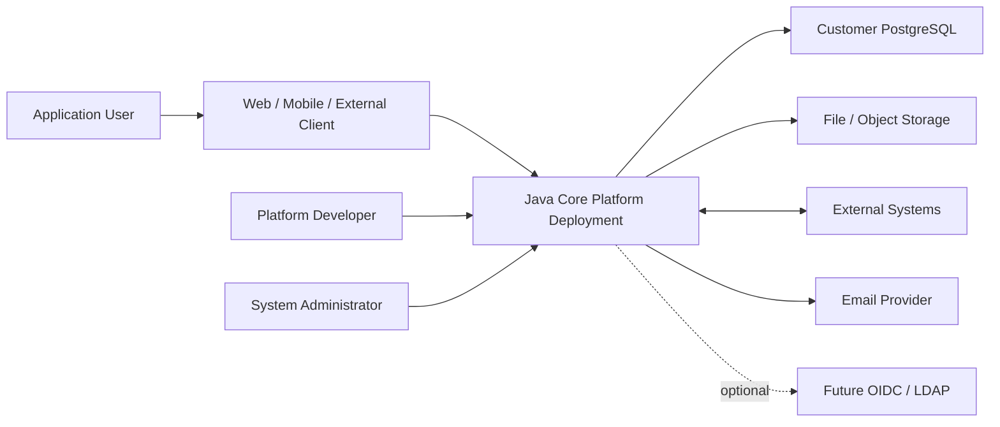

## 5. Container architecture

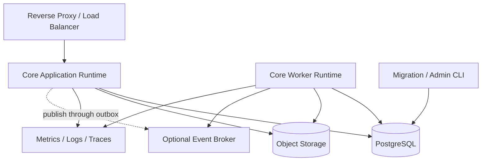

Một source artifact có thể chạy theo các profile:

| Profile | Trách nhiệm |
|---|---|
| `api` | HTTP API, authentication, authorization và synchronous use case |
| `worker` | Job execution, outbox relay, webhook và asynchronous handler |
| `scheduler` | Tạo scheduled job; có leader lock |
| `migration` | Validate và thực thi migration trước rollout |
| `all-in-one` | API + worker + scheduler cho Pilot/Development |

## 6. Component architecture

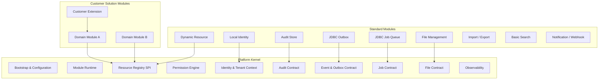

### 6.1 Platform Kernel

Kernel chỉ chứa contract và cơ chế kỹ thuật ổn định:

- bootstrap/configuration validation;
- module discovery, dependency graph và compatibility;
- tenant/security context;
- permission evaluation contract;
- resource registry;
- transaction-bound audit/outbox interfaces;
- job và file interfaces;
- error/correlation/observability conventions.

Kernel MUST NOT chứa:

- entity của khách hàng hoặc ngành;
- generic repository truy cập mọi bảng;
- workflow engine tự xây;
- business validation;
- UI form cụ thể;
- customer-specific integration.

### 6.2 Standard Modules

Standard module là implementation có thể bật/tắt, version độc lập nhưng tương thích với Core:

- Local Identity;
- Dynamic Resource;
- Audit Store;
- JDBC Outbox/Event Relay;
- JDBC Job Queue/Scheduler;
- File Management;
- Import/Export;
- Basic Search;
- Webhook/Notification.

### 6.3 Domain và Customer Modules

Mỗi module MUST có:

- một owner;
- public API package hoặc named interface;
- internal package không được module khác truy cập;
- aggregate/data ownership;
- migration riêng;
- event published/consumed;
- manifest và compatibility range;
- unit/module integration tests.

## 7. Module contract và packaging

### 7.1 Manifest logic

```yaml
name: sample-domain
version: 1.0.0
coreCompatibility: ">=1.0.0 <2.0.0"
requiredModules:
  - name: local-identity
    version: ">=1.0.0 <2.0.0"
optionalModules:
  - dynamic-resource
capabilities:
  - sample-resource-api
publishedEvents:
  - sample.created.v1
consumedEvents: []
```

### 7.2 Dependency rules

- Dependency graph MUST không có cycle.
- Module chỉ tham chiếu public API/named interface của module khác.
- Shared kernel types phải nhỏ, ổn định và không chứa domain model.
- Module không được truy cập bảng/repository của module khác.
- Optional dependency phải được bảo vệ bằng capability check.
- Runtime feature flag không được phá dependency graph đã build.

### 7.3 Enable/disable rules

- Module required không thể disable nếu module phụ thuộc đang enabled.
- Disable module không tự động xóa dữ liệu.
- Module có persistent data cần deactivation plan.
- Module enable lần đầu cần migration thành công trước registration.
- Mọi thay đổi trạng thái module phải audit.

## 8. Runtime bootstrap

### 8.1 Trạng thái instance

```text
STARTING → VALIDATING → MIGRATING → REGISTERING → WARMING → READY
     └────────────── any fatal error ─────────────────────→ FAILED
```

### 8.2 Trình tự khởi động

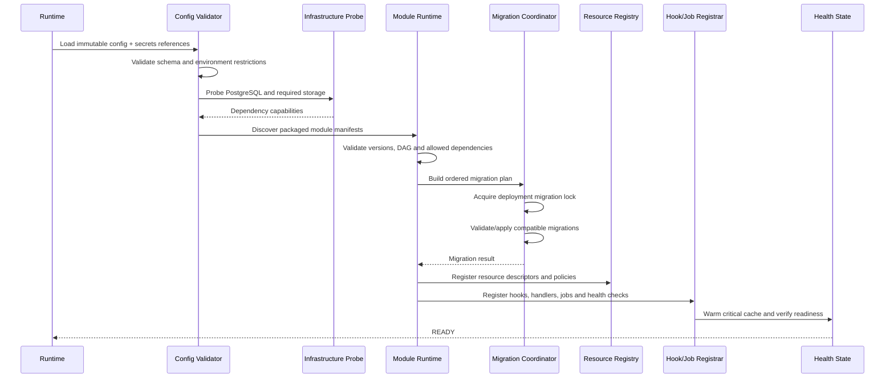

### 8.3 Bootstrap phases

1. **Configuration:** đọc config, secret reference và runtime profile; từ chối dev-only option ở production.
2. **Dependency probe:** kiểm tra database, file storage và dependency bắt buộc.
3. **Module discovery:** đọc manifest của module đã đóng gói.
4. **Compatibility:** kiểm tra Core range, module range, duplicate capability và dependency cycle.
5. **Migration:** migration theo dependency order dưới deployment lock.
6. **Registration:** resource descriptor, policy, hook, event handler và job type.
7. **Warm-up:** compile policy, cache metadata nhỏ và kiểm tra critical dependency.
8. **Readiness:** chỉ Ready nếu mọi invariant bắt buộc đạt.

### 8.4 Fatal và degradable dependency

| Dependency | Khi lỗi lúc startup |
|---|---|
| PostgreSQL | Fatal; instance không Ready |
| Required migration | Fatal |
| Module compatibility | Fatal |
| Required file store | Fatal nếu module file bắt buộc |
| Kafka/optional broker | Degraded; outbox giữ event |
| SMTP | Degraded; email job retry |
| Optional search adapter | Degraded hoặc fallback basic search |
| Metrics backend | Không chặn Ready; local telemetry vẫn phát |

## 9. Request lifecycle

### 9.1 Luồng chuẩn

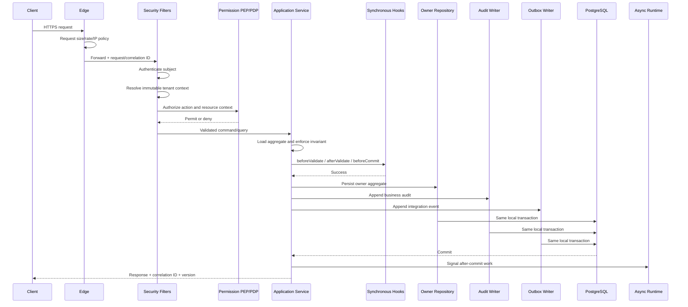

### 9.2 Request stages

1. Edge giới hạn payload, connection và rate.
2. Correlation ID được validate hoặc tạo mới; client không được giả mạo trusted trace metadata.
3. Authentication tạo `SubjectContext`.
4. Tenant resolver tạo `TenantContext` bất biến.
5. Controller chỉ parse/validate transport contract.
6. Application service xác định use case và transaction boundary.
7. Permission Enforcement Point gọi Permission Decision Point.
8. Owner module tải aggregate và kiểm tra invariant.
9. Synchronous hook chạy theo policy.
10. Aggregate, business audit và outbox commit cùng transaction.
11. Sau commit, async work được relay; response không chờ external consumer.
12. Metric/trace ghi outcome và latency.

### 9.3 Query flow

- Query vẫn phải authenticate, resolve tenant và authorize.
- Query MUST dùng projection/repository do owner module công bố.
- Generic filter chỉ cho phép field/operator trong allowlist.
- Query không tạo business audit trong transaction nếu chỉ đọc thông thường; security audit MAY ghi riêng cho export, dữ liệu nhạy cảm hoặc administrative access.
- Export lớn phải chuyển thành background job.

### 9.4 Error contract

Mọi lỗi API dùng Problem Details-compatible envelope, chứa `code`, `status`, `detail` an toàn và `correlationId`. Không trả stack trace, SQL, secret hoặc internal class name.

## 10. Security architecture

### 10.1 Trust boundaries

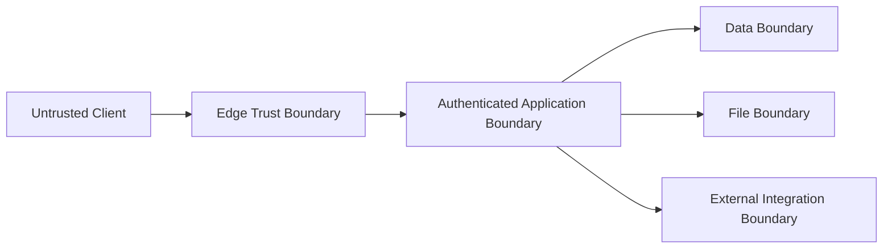

### 10.2 Local identity baseline

- Password không lưu dạng rõ; dùng password hashing algorithm và cost được Security Approver cấu hình.
- Access credential ngắn hạn; refresh/session credential có rotation và revoke.
- Administrator production bắt buộc MFA.
- Login, failure, lockout, password reset và privilege change phải security audit.
- Service account có scope, expiry/rotation và không dùng chung với human account.
- Authentication adapter phải cho phép OIDC/LDAP ở giai đoạn sau mà không thay domain module.

### 10.3 Tenant context

- Tenant được suy ra từ credential và trusted deployment mapping.
- `tenant_id` do client gửi trong header/body không có giá trị thẩm quyền.
- Tenant context bất biến trong request và phải truyền rõ vào job/event.
- Thiếu tenant context ở thao tác tenant-owned phải fail closed.
- System context chỉ dành cho use case được allowlist và audit.

### 10.4 Permission architecture

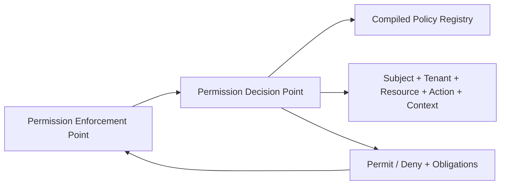

- PEP nằm ở application-service boundary; annotation ở controller không phải lớp bảo vệ duy nhất.
- PDP trả Permit/Deny và obligation như field masking hoặc audit requirement.
- Policy không tồn tại hoặc lỗi evaluation trả Deny.
- Record-level permission phải được đẩy xuống query predicate; không đọc toàn bộ rồi lọc trong memory.
- Permission cache key gồm tenant, subject/policy version, resource và action.
- Role/policy change phải tăng version hoặc invalidation cache.
- Owner module chịu trách nhiệm cung cấp resource attributes cần cho ABAC.

### 10.5 Security controls

- TLS ở mọi network boundary production.
- Secret không nằm trong source, image hoặc log.
- CSRF áp dụng khi dùng cookie session; CORS dùng allowlist.
- Rate limit riêng cho login, reset password, export và upload.
- Input validation ở transport và domain boundary.
- Dependency/SBOM/security scan trong CI.
- Administrative endpoint tách permission và audit.

## 11. Transaction architecture

### 11.1 Quy tắc

- Application service xác định transaction boundary.
- Một transaction có một aggregate root chính và một owner module.
- Không gọi HTTP, broker, SMTP hoặc object store trong transaction.
- Không mở transaction trong controller hoặc asynchronous relay.
- Optimistic locking là mặc định cho aggregate có concurrent update.
- Pessimistic lock chỉ dùng với use case được benchmark và ADR/module decision.
- Retry transaction conflict phải bounded và chỉ khi operation idempotent.

### 11.2 Cross-module consistency

| Nhu cầu | Cơ chế |
|---|---|
| Đọc synchronous từ module khác | Public query port, không truy cập repository |
| Validation cần dữ liệu ổn định | Snapshot/value contract hoặc orchestrated application service |
| Cập nhật module khác | Domain/integration event sau commit |
| Cần atomicity tuyệt đối | Xem lại aggregate/module boundary trước khi dùng distributed pattern |
| Quy trình dài | Saga/process manager hoặc workflow adapter ở giai đoạn sau |

### 11.3 Idempotent command

Command có thể retry từ client hoặc integration phải hỗ trợ idempotency key theo tenant + operation scope. Kết quả cũ chỉ được trả lại khi request fingerprint tương thích.

## 12. Hook architecture

### 12.1 Hook types

| Hook | Transaction | I/O mạng | Được sửa aggregate | Failure behavior |
|---|---|---:|---:|---|
| `beforeValidate` | Trong | Không | Có, trong giới hạn contract | Rollback |
| `afterValidate` | Trong | Không | Hạn chế | Rollback |
| `beforeCommit` | Trong | Không | Có theo owner contract | Rollback |
| `afterCommit` | Ngoài | Qua job/event | Không sửa transaction cũ | Retry/DLQ |

### 12.2 Registration và ordering

- Hook khai báo target resource, phase, owner module và order.
- Order phải deterministic: dependency order → explicit order → stable handler name.
- Duplicate exclusive hook làm startup fail.
- Hook synchronous phải có time budget và metric riêng.
- Hook không được dùng reflection để truy cập internal aggregate ngoài contract.
- Customer extension hook chỉ được móc vào extension point đã công bố.

### 12.3 Failure

- Synchronous hook lỗi làm transaction rollback và trả domain-safe error.
- `afterCommit` không chạy inline như remote call; nó tạo/consume durable event hoặc job.
- Handler lỗi được retry; quá ngưỡng chuyển DLQ/failed state và alert.

## 13. Audit architecture

### 13.1 Hai loại audit

| Loại | Nội dung | Consistency |
|---|---|---|
| Business audit | Create/update/delete/transition, before-after summary | Cùng transaction nghiệp vụ |
| Security audit | Login, deny, admin access, credential/policy change | Durable append, không làm lộ secret |

### 13.2 Audit record logic

Audit tối thiểu chứa:

- audit ID và occurred time;
- tenant, subject và actor type;
- action, resource type/ID và owner module;
- result và reason code;
- correlation/causation ID;
- source channel/IP/client metadata phù hợp;
- changed-field summary đã masking;
- policy/resource version.

### 13.3 Quy tắc

- Audit append-only ở application contract; không cung cấp update/delete API thông thường.
- Password, token, secret và raw sensitive value không được ghi.
- Before/after snapshot đầy đủ chỉ dùng khi classification và retention cho phép.
- Export/read audit cho dữ liệu nhạy cảm được policy quyết định.
- Audit failure trong business transaction critical phải làm transaction rollback.
- Retention, archive và access phải cấu hình theo hợp đồng/compliance.

## 14. Event và outbox architecture

### 14.1 Event taxonomy

| Loại | Phạm vi | Ví dụ |
|---|---|---|
| Domain event | Bên trong module/application | Aggregate state changed |
| Application event | Giữa module trong deployment | Module coordination |
| Integration event | Ra ngoài deployment/broker/webhook | Versioned public contract |

Domain object không phụ thuộc Kafka type hoặc transport schema.

### 14.2 Outbox flow

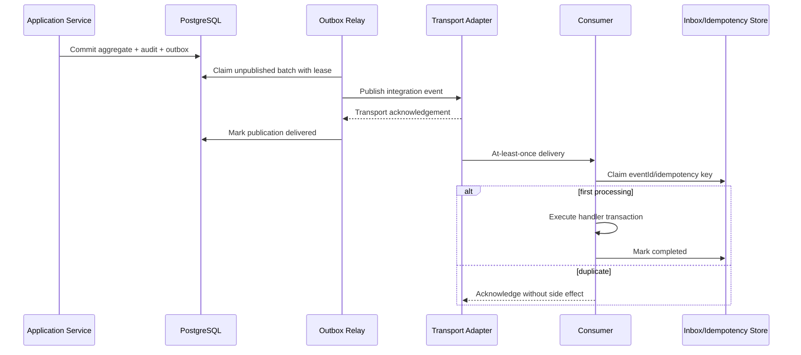

### 14.3 Delivery adapter

- Pilot/Standard không có broker: durable local publication handler và webhook job dùng JDBC outbox.
- Khi có Kafka: outbox relay publish tới Kafka; application transaction không đổi.
- Broker lỗi không rollback business transaction đã commit; outbox lag tăng và alert.
- Relay dùng lease/claim để nhiều worker không publish cùng record đồng thời.
- Mark-delivered xảy ra sau transport acknowledgement; crash có thể tạo duplicate, consumer phải idempotent.

### 14.4 Event contract

Integration event bắt buộc có:

- `eventId`, `eventType`, `eventVersion`;
- `occurredAt`, producer/module version;
- tenant, aggregate type/ID/version;
- correlation và causation ID;
- data contract không chứa internal entity serialization.

Breaking change tạo event version mới. Schema compatibility test chạy trong CI.

### 14.5 DLQ và replay

- Poison event không retry vô hạn.
- Failed handler lưu error category, attempt và next action.
- Replay cần permission riêng, reason, phạm vi và audit.
- Replay không được bỏ qua idempotency nếu không có approved recovery procedure.

## 15. Background job và scheduler

### 15.1 Job lifecycle

```text
SCHEDULED → READY → CLAIMED → RUNNING → SUCCEEDED
                         ├── retryable → READY
                         ├── exhausted → DEAD
                         └── cancelled → CANCELLED
```

### 15.2 Job contract

Job gồm:

- job ID/type/version;
- tenant và subject/system context;
- payload reference hoặc payload đã classification;
- idempotency key;
- priority, scheduled time và attempts;
- lease owner/expiry, heartbeat và checkpoint;
- correlation/causation ID.

### 15.3 Execution rules

- API enqueue job trong transaction khi job phụ thuộc business commit.
- Worker claim bằng lease; worker chết thì lease hết hạn và job được claim lại.
- Handler phải idempotent.
- Long job phải heartbeat/checkpoint và hỗ trợ cancellation tại safe point.
- Retry dùng exponential backoff + jitter và phân loại retryable/non-retryable.
- Payload lớn/sensitive lưu qua secure reference, không nhồi vào queue record.
- Scheduler dùng distributed lock/leader lease để tránh tạo job trùng.
- Export/import có progress, result file expiry và authorization khi download.

## 16. File architecture

### 16.1 Thành phần

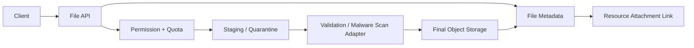

### 16.2 Upload flow

1. Authenticate, resolve tenant và authorize upload target.
2. Kiểm tra size, extension/MIME policy, quota và filename.
3. Tạo upload session có expiry.
4. Stream tới staging; không giữ toàn bộ file trong memory.
5. Tính checksum và validate actual content type.
6. Chạy malware-scan adapter khi tier/hợp đồng yêu cầu.
7. Finalize object và metadata; liên kết resource trong transaction phù hợp.
8. Xóa staging/orphan bằng scheduled cleanup.

### 16.3 Download flow

- Mọi download phải authorize tại thời điểm yêu cầu.
- Có thể stream qua application hoặc phát signed URL thời hạn ngắn.
- Signed URL phải scope đúng object, tenant và action.
- Sensitive download có thể yêu cầu security audit.
- Object key không chứa filename/PII có thể đoán được.

### 16.4 Storage adapters

- Development/Pilot MAY dùng filesystem adapter nếu backup và path isolation được bảo đảm.
- Production SHOULD dùng S3-compatible object storage.
- Database chỉ lưu metadata/reference, không lưu file lớn mặc định.
- File deletion mặc định là soft-delete + retention; physical purge là job có audit.

## 17. Dynamic Resource runtime

### 17.1 Registration

Dynamic Resource module đọc definition đã version, validate field type/reference/policy, compile schema và đăng ký `ResourceDescriptor` vào Resource Registry.

### 17.2 Command flow

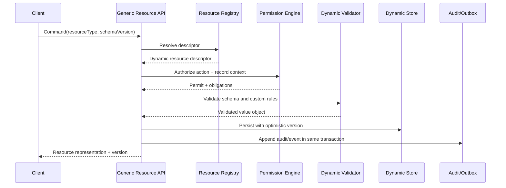

### 17.3 Guardrails

- Generic API chỉ phục vụ descriptor có `storageMode=DYNAMIC`.
- Definition change không tự apply production nếu chưa có migration plan.
- Field/operator query phải allowlist.
- Không hỗ trợ dynamic server script trong MVP.
- Dynamic Resource không được gọi là domain aggregate chỉ vì có nhiều field.
- Classification gate là architecture test/review artifact bắt buộc.

## 18. Domain Resource runtime

Code-first domain module:

- cung cấp application command/query interface riêng;
- sở hữu typed aggregate và relational repository;
- dùng `DomainResourceAdapter` để đăng ký permission/audit/presentation capability cần thiết;
- không đi qua Generic CRUD nếu use case cần domain-specific command;
- phát domain event từ aggregate/application service và map sang integration event;
- có migration và performance test riêng.

REST endpoint nên phản ánh use case (`approve`, `cancel`, `allocate`) thay vì ép mọi thao tác thành PATCH generic.

## 19. Observability

### 19.1 Signals

- Structured logs.
- Metrics.
- Distributed traces.
- Business/security audit.

### 19.2 Correlation

Request, event và job phải truyền correlation/causation ID. Không tin trực tiếp privileged tracing header từ untrusted client.

### 19.3 Baseline metrics

| Nhóm | Metrics |
|---|---|
| HTTP | rate, p50/p95/p99 latency, error, active request |
| Database | pool saturation, query latency, lock/transaction failure |
| Outbox | oldest age, pending, publish rate/failure |
| Job | queue depth, oldest age, retry/dead, execution duration |
| File | upload/download error, bytes, orphan/quarantine age |
| Security | login failure, deny rate, lockout, admin action |
| Module | startup/migration time, hook latency/error |

### 19.4 Health endpoints

- Liveness: process có thể tiếp tục chạy; không probe mọi external dependency.
- Readiness: dependency bắt buộc và migration/module state hợp lệ.
- Startup: cho phép migration/warm-up dài hơn readiness timeout.
- Endpoint chi tiết chỉ dành cho administrative network/permission.

## 20. Deployment architecture

### 20.1 Pilot tier

```mermaid
flowchart TB
    RP["Reverse Proxy"] --> APP["Core all-in-one container"]
    APP --> PG[(PostgreSQL)]
    APP --> OBJ[(Filesystem or Object Storage)]
    BAK["Encrypted Backup"] <-- PG
    BAK <-- OBJ
```

- Một VM có thể chạy Docker Compose.
- Không tuyên bố HA.
- Backup phải nằm ngoài failure domain của VM.
- Phù hợp availability 99%, RPO 24 giờ, RTO 8 giờ.

### 20.2 Standard tier

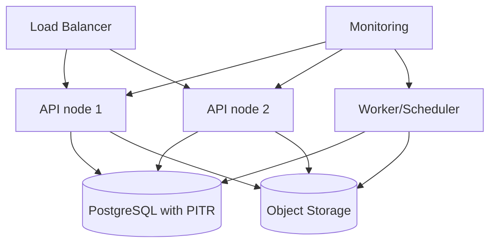

- Stateless API nodes; session/credential state không phụ thuộc local memory.
- PostgreSQL hỗ trợ PITR để đáp ứng RPO.
- Scheduler dùng leader lock.
- Rolling deployment theo expand-and-contract migration.

### 20.3 Critical tier

```mermaid
flowchart TB
    IN["Ingress / WAF"] --> API["Kubernetes API Deployment"]
    API --> PG["HA PostgreSQL + PITR"]
    API --> OBJ["Replicated Object Storage"]
    WK["Worker Deployment"] --> PG
    WK --> OBJ
    WK --> BUS["Event Broker when required"]
    DR["DR Backup / Replica"] <-- PG
    DR <-- OBJ
    OBS["Central Observability"] --> API
    OBS --> WK
```

- Kubernetes chỉ là một deployment profile, không làm domain code phụ thuộc Kubernetes.
- Multi-zone/DR topology phụ thuộc hợp đồng và hạ tầng khách hàng.
- RPO 15 phút/RTO 1 giờ chỉ được cam kết sau restore/failover drill đạt.

### 20.4 Deployment sequence

1. Build, test, scan và ký/tag artifact.
2. Backup/pre-deployment verification.
3. Chạy migration preflight.
4. Apply expand-compatible migration bằng migration job có lock.
5. Rolling deploy application/worker.
6. Smoke test và SLI verification.
7. Enable new behavior/feature flag nếu có.
8. Contract cleanup chỉ ở release sau khi phiên bản cũ không còn chạy.

## 21. Configuration và secrets

- Configuration có schema, default an toàn và startup validation.
- Secret chỉ đi qua environment/secret file/secret manager adapter; không commit.
- Customer-specific config tách khỏi Core source nhưng nằm trong delivery package ở dạng template hoặc encrypted deployment asset phù hợp.
- Production không tự động dùng development default.
- Thay đổi config critical phải audit và có restart/reload semantics rõ.
- Runtime không cho client sửa arbitrary environment configuration.

## 22. Failure model và recovery

### 22.1 Failure behavior matrix

| Failure | Hành vi hệ thống | Mất dữ liệu? | Recovery |
|---|---|---:|---|
| PostgreSQL unavailable | API write/read phụ thuộc DB trả 503; instance Not Ready | Không nếu storage bền | Khôi phục DB/failover, kiểm tra transaction |
| Transaction deadlock/conflict | Rollback; retry bounded nếu idempotent | Không | Retry hoặc client conflict response |
| Synchronous hook lỗi | Rollback toàn transaction | Không | Sửa input/hook; không chạy partial side effect |
| Worker chết giữa job | Lease hết hạn, job được claim lại | Không, có thể duplicate | Idempotent handler |
| Broker unavailable | Business commit thành công, outbox tồn đọng | Không | Relay tự gửi lại; alert theo lag |
| Event consumer lỗi | Retry rồi DEAD/DLQ | Không, process delayed | Triage, fix và audited replay |
| Object storage unavailable | File operation fail/degraded; business không phụ thuộc file vẫn chạy | Không nếu object store bền | Restore connectivity/storage |
| Upload bị ngắt | Staging object hết hạn | Không có committed file | Cleanup job |
| Migration lỗi | Deployment dừng, app mới không Ready | Có thể nếu migration không an toàn | Roll-forward hoặc approved rollback |
| Module incompatibility | Startup fail-fast | Không | Sửa artifact/manifest |
| Permission service lỗi | Deny/fail closed | Không | Khôi phục policy registry/cache |
| Observability backend lỗi | App tiếp tục, buffer/drop theo policy | Business: không | Alert cục bộ, khôi phục backend |
| Disk đầy | Readiness fail/degraded, write bị chặn | Có rủi ro | Capacity alert, mở rộng/cleanup an toàn |

### 22.2 Recovery principles

- Roll-forward là mặc định cho migration đã apply.
- Backup chỉ có giá trị khi restore test thành công.
- Database và object storage phải có recovery point tương thích.
- Outbox/job/audit nằm trong kế hoạch backup và restore.
- Sau restore phải đánh giá duplicate event/job trước khi worker chạy lại.
- Recovery action phải có runbook, owner, timestamp và audit/incident record.

### 22.3 Recovery startup mode

Hệ thống SHOULD có maintenance/recovery mode:

- chặn public write;
- cho phép migration/repair command có kiểm soát;
- tạm dừng outbox/job relay;
- kiểm tra consistency;
- resume theo thứ tự database → application → worker → external publication.

### 22.4 Disaster recovery sequence

1. Tuyên bố incident và đóng write traffic.
2. Chọn recovery point theo RPO.
3. Restore/failover PostgreSQL.
4. Restore/validate object storage reference.
5. Chạy schema/module compatibility check.
6. Khởi động API ở maintenance mode.
7. Chạy consistency/smoke test.
8. Mở read/write traffic.
9. Resume worker/outbox với idempotency guard.
10. Theo dõi lag, duplicate và error; lập incident report.

## 23. Source delivery architecture

Customer delivery phải tạo từ release tag và bao gồm:

- backend/frontend source đầy đủ;
- standard/domain/customer modules được sử dụng;
- build wrapper và dependency lock/BOM;
- migration, seed hợp lệ và tests;
- Dockerfile/Compose/Helm theo deployment;
- configuration templates;
- API/event/module contracts;
- SBOM, third-party notices và release notes;
- operations, backup/restore/upgrade runbooks.

Clean-room pipeline phải chứng minh build/test/deploy không cần private binary, private repository hoặc máy cá nhân không bàn giao.

## 24. Architecture fitness functions

Các rule sau phải chạy tự động trong CI:

| Fitness function | Điều kiện đạt |
|---|---|
| Module boundary | Không access internal package/table/repository xuyên module |
| Dependency graph | Không cycle, chỉ dependency được manifest cho phép |
| Kernel neutrality | Không domain/customer type trong kernel package |
| Dynamic classification | Mỗi Dynamic Resource có approved classification record |
| Transaction network rule | Không remote client trong transactional package/path |
| Hook rule | Synchronous hook không gọi I/O adapter bị cấm |
| Tenant isolation | Negative tests không cross-tenant read/write/export/job |
| Permission fail-closed | Missing/error policy luôn Deny |
| Event compatibility | Integration event schema backward-compatible |
| Migration compatibility | App N và N-1 cùng hoạt động trong expand phase |
| Source reproducibility | Clean-room build và test thành công |
| Recovery | Restore drill đạt service tier đã cam kết |

## 25. Requirement traceability

| BA requirement | Kiến trúc đáp ứng |
|---|---|
| CAP-001 | Mục 3, 6, 17, 18 |
| CAP-002 | Mục 17 |
| CAP-003 | Mục 18 |
| CAP-004 | Mục 9, 17, 18 |
| CAP-005–007 | Mục 10 |
| CAP-008–009 | Mục 13, owner-module history contract |
| CAP-010 | Mục 12 |
| CAP-011 | Mục 14 |
| CAP-012 | Mục 15 |
| CAP-013 | Mục 16 |
| CAP-014–018 | Standard modules tại Mục 6; flow chi tiết ở backlog kiến trúc module |
| CAP-019 | Mục 7–8 |
| CAP-020 | Mục 10 |
| CAP-021 | Mục 14–15 |
| CAP-022–023 | Mục 23–24 |
| FR-001–002 | Mục 7, 17, 18 |
| FR-003–006 | Mục 9–13 |
| FR-007–008 | Mục 14–15 |
| FR-009 | Mục 16 |
| FR-010 | Mục 8, 20 |
| FR-011 | Mục 23 |
| DEP-001–003 | Mục 20–21 |

## 26. Architecture acceptance criteria

Tài liệu đủ điều kiện chuyển sang thiết kế database khi:

- [ ] Technical Lead phê duyệt module boundaries và Three-Plane runtime.
- [ ] Security Approver phê duyệt trust boundary, identity, tenant và permission flow.
- [ ] Platform/DevOps owner phê duyệt deployment/failure/recovery model.
- [ ] Mỗi component có owner và public contract dự kiến.
- [ ] Bootstrap, request, transaction, hook, audit, outbox, job và file flow không còn conflict.
- [ ] Pilot/Standard/Critical topology được chấp nhận.
- [ ] Không có remote call trong transaction path.
- [ ] Source delivery clean-room requirement được giữ nguyên.
- [ ] Open decisions tại Mục 27 có owner và deadline hoặc đã đóng.

## 27. Accepted decisions cho thiết kế database

| ID | Quyết định đã chốt | Trạng thái |
|---|---|---|
| OD-01 | Access token ngắn hạn; refresh/session credential opaque, rotating, chỉ lưu hash và hỗ trợ revoke theo session/family | Accepted |
| OD-02 | Argon2id là password-hash baseline; cost được benchmark theo môi trường, không thấp hơn security baseline được ghi trong ADR; hỗ trợ rehash khi đăng nhập | Accepted |
| OD-03 | Dynamic Resource dùng shared typed-record table với JSONB payload, common typed columns và governed expression/partial indexes; không tạo table động cho mỗi definition | Accepted |
| OD-04 | Job queue, outbox và inbox/idempotency dùng logical table/schema riêng nhưng cùng PostgreSQL deployment ở baseline | Accepted |
| OD-05 | Filesystem adapter chỉ cho development/Pilot có off-host backup; production Standard/Critical dùng S3-compatible object storage | Accepted |
| OD-06 | Audit append-only, database role hạn chế, hash-chain theo batch và signed/externally stored checkpoint; retention/purge theo approved policy | Accepted |
| OD-07 | PostgreSQL full-text search + `pg_trgm` là baseline; external search chỉ dùng khi benchmark hoặc hợp đồng chứng minh cần thiết | Accepted |

## 28. Approver chain

| Phạm vi | Approver | Trạng thái |
|---|---|---|
| Product/BA consistency | Project Sponsor | Approved ở `CP-BA-001` |
| Component/runtime architecture | Technical Lead | Pending |
| Security/tenant/permission | Security Approver | Pending |
| Deployment/operations/recovery | Platform/DevOps Owner | Pending |
| Database handoff | Data Architect | Pending |

## Phụ lục A — Package boundary đề xuất

```text
com.company.platform
├── kernel
│   ├── bootstrap
│   ├── module
│   ├── security
│   ├── permission
│   ├── resource
│   ├── audit
│   ├── event
│   ├── job
│   ├── file
│   └── observability
├── modules
│   ├── identity
│   │   ├── api
│   │   └── internal
│   ├── dynamicresource
│   │   ├── api
│   │   └── internal
│   ├── auditstore
│   ├── outbox
│   ├── jobqueue
│   └── filemanagement
└── solution
    ├── domaina
    │   ├── api
    │   └── internal
    └── customerextension
```

`internal` không được tham chiếu từ module khác. Public type phải nhỏ, version được và không expose persistence entity.

## Phụ lục B — Definition of Ready cho database design

Database design chỉ bắt đầu khi:

1. Resource classification gate đã chốt.
2. Owner module của từng logical store đã rõ.
3. Transaction boundary và consistency requirement đã rõ.
4. Tenant isolation strategy đã được Security Approver chấp nhận.
5. Audit/outbox/job/file lifecycle và retention input đã có.
6. OD-03 và OD-04 được đóng bằng ADR.
