# Java Core Platform — Technical Implementation Specification

| Thuộc tính | Giá trị |
|---|---|
| Mã tài liệu | `CP-TIS-005` |
| Phiên bản | `1.0.0` |
| Trạng thái | Approved Baseline |
| Ngày | 2026-08-15 |
| Nguồn | `CP-BA-001`, `CP-ARCH-002`, `CP-DATA-003` |

## 1. Implementation objective

Xây một Java Core Platform trung lập với nghiệp vụ, dùng nội bộ để phát triển hệ thống cho nhiều khách hàng và lĩnh vực. Core cung cấp capability kỹ thuật; nghiệp vụ nằm trong solution/domain module.

MVP phải chứng minh:

1. Module boundary được cưỡng chế tự động.
2. Tenant A không truy cập được dữ liệu tenant B.
3. Một code-first aggregate hoạt động đầy đủ.
4. Một Dynamic Resource hoạt động qua module tùy chọn.
5. Audit và outbox commit cùng transaction nghiệp vụ.
6. Job và event handler chống xử lý trùng.
7. Source package có thể build/deploy trong môi trường sạch.

## 2. Mandatory constraints

- MUST dùng modular monolith cho MVP.
- MUST NOT tạo nghiệp vụ ERP/CRM/MES trong kernel.
- MUST NOT tải JAR/script tùy ý ở production.
- MUST NOT gọi HTTP, broker, SMTP hoặc object storage trong database transaction.
- MUST NOT truy cập repository/table nội bộ xuyên module.
- MUST dùng fail-closed cho tenant và permission.
- MUST ghi business audit và outbox trong cùng transaction khi use case yêu cầu.
- MUST dùng at-least-once + idempotency cho event/job.
- MUST bàn giao toàn bộ source/artifact cần để hệ thống chạy độc lập.

## 3. Technology baseline

| Capability | Baseline |
|---|---|
| Language | Java 21 |
| Framework | Spring Boot 3.x; pin exact patch trong BOM |
| Module verification | Spring Modulith + ArchUnit |
| Build | Maven Wrapper, Maven multi-module |
| Database | PostgreSQL |
| Migration | Flyway theo module/schema |
| Security | Spring Security; Local Identity adapter |
| Persistence | Spring Data JPA/JDBC theo module; không expose entity |
| JSON | Jackson, schema validation adapter |
| API | REST + OpenAPI; Problem Details-compatible error |
| Metrics/tracing | Micrometer + OpenTelemetry-compatible export |
| Tests | JUnit 5, Testcontainers, architecture tests |
| Packaging | OCI image, Docker Compose, Helm cho Kubernetes profile |

Exact dependency version phải:

- nằm trong `platform-bom`;
- không dùng dynamic version/range trong build;
- có SBOM;
- qua compatibility test;
- được cập nhật bằng pull request riêng.

## 4. Repository structure

```text
core-platform/
├── pom.xml
├── mvnw / mvnw.cmd / .mvn/
├── platform-bom/
├── platform-kernel/
│   ├── kernel-api/
│   └── kernel-runtime/
├── standard-modules/
│   ├── local-identity/
│   ├── permission/
│   ├── audit-store/
│   ├── event-outbox/
│   ├── job-queue/
│   ├── file-management/
│   ├── dynamic-resource/
│   ├── import-export/
│   ├── basic-search/
│   └── webhook/
├── sample-modules/
│   └── sample-domain/
├── runtime-app/
├── database/
│   ├── roles/
│   ├── bootstrap/
│   └── test-fixtures/
├── deployment/
│   ├── docker-compose/
│   ├── container/
│   └── helm/
├── docs/
└── quality/
```

Mỗi module có tối thiểu:

```text
<module>/
├── pom.xml
├── src/main/java/.../<module>/api/
├── src/main/java/.../<module>/internal/
├── src/main/resources/db/migration/<module>/
├── src/test/java/
└── module-manifest.yaml
```

## 5. Java package rules

- Root package: `com.company.platform` — thay `company` bằng namespace pháp lý đã chốt.
- `api` chứa public port, command/query DTO và published event contract.
- `internal` chứa persistence entity, repository implementation và service nội bộ.
- Public API không trả JPA entity.
- Kernel API không phụ thuộc standard/domain module.
- Domain module không phụ thuộc implementation của kernel adapter.
- Circular dependency làm build fail.

Architecture test tối thiểu:

```java
ApplicationModules.of(PlatformApplication.class).verify();
```

Thêm ArchUnit rule cấm:

- `..internal..` bị truy cập ngoài module;
- remote client được gọi từ transactional package;
- domain package xuất hiện trong kernel;
- controller truy cập repository trực tiếp;
- module truy cập schema/table module khác qua native query.

## 6. Platform Kernel APIs

Kernel API phải nhỏ, không chứa domain model.

### 6.1 Module runtime

```java
public interface PlatformModule {
    ModuleDescriptor descriptor();
    void register(ModuleRegistrationContext context);
}
```

`ModuleDescriptor` gồm name, version, Core range, required/optional capability, published/consumed contract và checksum.

### 6.2 Resource Registry

```java
public interface ResourceRegistry {
    void register(ResourceDescriptor descriptor);
    Optional<ResourceDescriptor> find(ResourceType type);
}
```

`ResourceDescriptor` chỉ mô tả owner, storage mode, supported action, schema version, classification, permission/audit/presentation reference. Nó không chứa generic repository.

### 6.3 Tenant context

```java
public interface TenantContextProvider {
    TenantContext required();
    Optional<TenantContext> current();
}
```

Không cung cấp `setTenant(String)` công khai trong business code. Context được tạo tại trusted boundary và truyền vào transaction interceptor.

### 6.4 Permission

```java
public interface PermissionDecisionPoint {
    PermissionDecision evaluate(AuthorizationRequest request);
}
```

Decision gồm Permit/Deny, reason code và obligations. Missing/error policy luôn Deny.

### 6.5 Audit

```java
public interface AuditWriter {
    void append(BusinessAuditRecord record);
}
```

Business audit writer dùng cùng transaction. Security audit dùng durable adapter riêng nhưng cùng canonical event contract.

### 6.6 Event/outbox

```java
public interface IntegrationEventPublisher {
    void enqueue(IntegrationEvent event);
}
```

Tên `publish` không được hiểu là gọi broker ngay. Adapter ghi outbox trong transaction.

### 6.7 Job

```java
public interface JobScheduler {
    JobId enqueue(JobCommand command);
    JobId schedule(JobCommand command, Instant runAt);
}
```

### 6.8 File

```java
public interface FileService {
    UploadSession beginUpload(BeginUploadCommand command);
    FileObject finalizeUpload(FinalizeUploadCommand command);
    DownloadGrant authorizeDownload(FileId id, SubjectContext subject);
}
```

## 7. Three-Plane implementation

### 7.1 Domain Model Plane

Mặc định cho aggregate có invariant, transaction, constraint, tải cao hoặc rủi ro tài chính/vận hành.

Domain module sở hữu:

- typed aggregate;
- application service;
- repository;
- database schema/migration;
- domain event mapping;
- command-specific REST API;
- performance/invariant tests.

Không ép `approve`, `cancel`, `allocate` thành generic PATCH.

### 7.2 Dynamic Resource Plane

Standard module tùy chọn, chỉ dành cho form/configuration/custom entity đơn giản.

Phải cung cấp:

- `ResourceDefinition` và version;
- `FieldDefinition`;
- definition compatibility validation;
- generic CRUD;
- schema validation;
- optimistic version;
- permission/audit/outbox integration;
- query allowlist;
- governed index compiler.

Không hỗ trợ runtime server script trong MVP.

### 7.3 Presentation & Policy Plane

Tách layout, label, localization, masking, permission và audit policy khỏi persistence schema. Đổi label/layout không tạo database migration.

### 7.4 Classification gate

Trước khi thêm entity, Technical Lead phải lưu quyết định:

```text
Resource:
Owner module:
Invariant critical:
Transaction complexity:
Constraint requirements:
Query/load profile:
Failure impact:
Selected mode: DOMAIN | DYNAMIC
Approver:
```

Khi chưa chắc chắn, chọn `DOMAIN`.

## 8. Runtime bootstrap implementation

Thứ tự bắt buộc:

1. Load configuration và secret reference.
2. Validate production restrictions.
3. Probe PostgreSQL/file dependency bắt buộc.
4. Discover packaged module manifests.
5. Verify Core/module versions và dependency DAG.
6. Acquire migration lock.
7. Run module migrations theo dependency order.
8. Register resource descriptor, policy, hook, handler và job type.
9. Warm critical cache.
10. Chuyển readiness sang Ready.

Module incompatibility, migration failure, duplicate exclusive hook hoặc missing required capability phải chặn Ready.

## 9. HTTP request implementation

Filter/order chuẩn:

```text
Edge policy
→ CorrelationIdFilter
→ AuthenticationFilter
→ TenantResolutionFilter
→ RequestSecurityContext
→ Controller transport validation
→ Application Service
→ Permission PEP/PDP
→ Transaction boundary
→ Domain/Dynamic validation
→ Synchronous hooks
→ Persistence + audit + outbox
→ Commit
→ Response + telemetry
```

Controller:

- không mở transaction;
- không truy cập repository;
- không xử lý permission chỉ bằng annotation;
- không trả stack trace/SQL/internal class;
- luôn trả correlation ID.

## 10. API conventions

### 10.1 Dynamic Resource API

```text
POST   /api/v1/resources/{resourceType}
GET    /api/v1/resources/{resourceType}/{id}
PATCH  /api/v1/resources/{resourceType}/{id}
DELETE /api/v1/resources/{resourceType}/{id}
GET    /api/v1/resources/{resourceType}
```

Chỉ hoạt động khi descriptor có `storageMode=DYNAMIC`.

### 10.2 Domain API

Domain module định nghĩa endpoint theo use case:

```text
POST /api/v1/<domain>/<resources>
POST /api/v1/<domain>/<resources>/{id}/approve
POST /api/v1/<domain>/<resources>/{id}/cancel
GET  /api/v1/<domain>/<resources>/{id}
```

### 10.3 Concurrency và retry

- Mutable resource trả `version` hoặc ETag.
- Update dùng `If-Match`/expected version.
- Retryable command hỗ trợ idempotency key.
- List dùng stable cursor khi dữ liệu lớn.
- Filter/sort/include dùng allowlist.

### 10.4 Error envelope

```json
{
  "type": "https://errors.example.com/validation-failed",
  "title": "Validation failed",
  "status": 400,
  "code": "RESOURCE_VALIDATION_FAILED",
  "detail": "One or more fields are invalid",
  "correlationId": "uuid",
  "errors": []
}
```

## 11. Security implementation

### 11.1 Local Identity

- Password hash: Argon2id.
- Initial floor: `m >= 19456 KiB`, `t >= 2`, `p >= 1`; benchmark và pin policy.
- Encoded hash lưu algorithm/parameters/salt.
- Access token ngắn hạn.
- Refresh credential opaque, random, rotating; chỉ lưu hash.
- Reuse refresh credential revoke session family.
- MFA bắt buộc cho administrator production.
- Account, role, credential và session change phải audit.

### 11.2 Tenant isolation

Trong mọi tenant transaction:

```sql
SELECT set_config('app.tenant_id', :tenant_id, true);
SELECT set_config('app.subject_id', :subject_id, true);
```

Mọi tenant table `ENABLE` và `FORCE ROW LEVEL SECURITY`. Runtime role không owner, superuser hoặc `BYPASSRLS`.

### 11.3 Authorization

- PEP ở application-service boundary.
- Record permission được chuyển thành query predicate.
- Field masking là obligation từ PDP.
- Cache key gồm tenant + subject/policy version + resource + action.
- Policy change tăng revision/invalidate cache.

## 12. Transaction and hook implementation

### 12.1 Transaction

- Một aggregate/module owner chính.
- Optimistic locking mặc định.
- Không network I/O.
- Cross-module update qua event sau commit.
- Atomicity xuyên module phải xem lại boundary trước khi thêm saga/workflow.

### 12.2 Hook

| Phase | Network I/O | Failure |
|---|---:|---|
| `beforeValidate` | Cấm | Rollback |
| `afterValidate` | Cấm | Rollback |
| `beforeCommit` | Cấm | Rollback |
| `afterCommit` | Qua event/job | Retry/DLQ |

Ordering: dependency order → explicit order → stable handler name.

## 13. Audit implementation

Business audit commit cùng transaction. Audit record gồm tenant, subject, action, resource, result, time, correlation/causation, masked change summary và chain data.

Controls:

- append-only application contract;
- runtime role không UPDATE/DELETE/TRUNCATE;
- hash-chain theo batch;
- signed/external checkpoint;
- secret/token/password không ghi audit;
- retention/legal hold có policy.

## 14. Event/outbox implementation

Transaction ghi aggregate + audit + `cp_event.outbox_event`.

Worker:

1. Claim pending batch bằng transaction ngắn + lease.
2. Commit claim.
3. Publish qua local durable handler/Kafka/webhook adapter.
4. Mark delivered sau acknowledgement.
5. Retry có backoff; vượt ngưỡng vào DEAD/DLQ.

Consumer dùng `cp_event.inbox_message` hoặc idempotency store. Duplicate event không được tạo side effect lần hai.

Integration event không serialize JPA entity. Contract bắt buộc có event ID/type/version, tenant, aggregate ID/version, producer, occurred time và correlation/causation.

## 15. Background job implementation

Baseline dùng `cp_job.job`, `job_attempt`, `scheduled_trigger`, `scheduler_lease`.

- Claim bằng lease và `SKIP LOCKED`.
- Không giữ row lock trong thời gian chạy job.
- Long job heartbeat/checkpoint.
- Retry theo error category, exponential backoff + jitter.
- Payload lớn/nhạy cảm dùng secure reference.
- DEAD job cần operator resolution/requeue audit.
- Scheduler dùng leader lease.

## 16. File implementation

Flow:

```text
authorize + quota
→ upload session
→ staging
→ checksum/type validation
→ optional malware scan
→ metadata finalize
→ object promote/tag
→ resource link
→ orphan reconciliation
```

Database chỉ lưu metadata. Standard/Critical dùng S3-compatible storage. Object key opaque và tenant-scoped. Signed download URL có thời hạn ngắn và chỉ phát sau authorization.

## 17. Database implementation

### 17.1 Schemas

```text
cp_core
cp_identity
cp_access
cp_dynamic
cp_audit
cp_event
cp_job
cp_file
cp_integration
m_<domain>
```

Mỗi schema có migration/history và owner module riêng.

### 17.2 Roles

- `cp_owner`: object owner, không runtime.
- `cp_migrator`: migration credential.
- `cp_app`: API DML, RLS enforced.
- `cp_worker`: worker DML, RLS enforced.
- `cp_readonly_ops`: allowlisted operations read.
- `cp_backup`: backup procedure.
- `cp_audit_checkpoint`: checkpoint operation.

### 17.3 Dynamic Resource storage

`cp_dynamic.resource_record` có common typed columns:

```text
id, tenant_id, definition_id, schema_version,
record_status, record_version,
owner_subject_id, organization_id,
data jsonb, search_text, search_vector,
created/updated/archived metadata
```

Không tạo GIN toàn payload mặc định. Index động chỉ từ allowlisted compiler template, partial theo `definition_id`. Không nhận raw SQL/JSONPath từ metadata.

### 17.4 Domain tables

Domain aggregate dùng typed table, constraint và migration riêng. Child phải bảo đảm cùng tenant. Không tạo FK sang internal domain table của module khác.

### 17.5 Migration

Expand-and-contract:

1. Add structure.
2. Deploy compatible code.
3. Backfill theo batch.
4. Validate.
5. Switch behavior.
6. Remove cũ ở release sau.

Applied migration immutable; roll-forward là mặc định.

## 18. Search implementation

- PostgreSQL full-text search + `pg_trgm` baseline.
- Search projection chỉ chứa field được policy cho phép.
- Tenant/resource scope bắt buộc.
- Không nhận raw `tsquery`, SQL hoặc JSONPath.
- External search cần benchmark/ADR.

## 19. Observability

Mọi request/event/job có correlation/causation ID.

Dashboard tối thiểu:

- HTTP rate/error/p95/p99.
- DB pool/query/lock/deadlock.
- Outbox pending/oldest/publish failure.
- Job depth/oldest/retry/dead.
- Audit checkpoint age/failure.
- File upload/error/orphan mismatch.
- Authentication failure/deny/admin action.
- Backup age/restore drill.

Liveness không probe mọi dependency. Readiness yêu cầu database, migration và required module hợp lệ.

## 20. Deployment profiles

### Pilot

- Docker Compose trên VM.
- All-in-one runtime.
- PostgreSQL + off-host backup.
- Filesystem hoặc object storage có backup.
- Không tuyên bố HA.

### Standard

- Load balancer + ≥2 API nodes.
- Worker/scheduler profile.
- PostgreSQL PITR.
- S3-compatible storage.
- Rolling deployment.

### Critical

- Kubernetes profile.
- HA PostgreSQL + PITR.
- Replicated object storage.
- Dedicated workers.
- Optional broker theo workload.
- DR drill phải chứng minh RPO/RTO.

## 21. Failure behavior

| Failure | Expected behavior |
|---|---|
| PostgreSQL down | Not Ready; API trả 503 phù hợp |
| Hook sync lỗi | Rollback toàn transaction |
| Worker chết | Lease hết hạn, job/event được claim lại |
| Broker down | Business commit giữ nguyên; outbox backlog + alert |
| Consumer lỗi | Retry rồi DEAD/DLQ |
| Object storage down | File capability degraded; không làm hỏng unrelated transaction |
| Migration lỗi | Deployment dừng, app mới không Ready |
| Permission lỗi | Deny/fail closed |
| Observability backend lỗi | Business tiếp tục; local signal/buffer policy |

Recovery order: database → object reconciliation → API maintenance mode → consistency test → traffic → worker/outbox.

## 22. Testing strategy

### 22.1 Test layers

- Unit test: domain invariant, validator, policy, mapper.
- Module test: public API và internal persistence trong module.
- Architecture test: dependency/boundary.
- Integration test: PostgreSQL/Testcontainers, RLS, migration, outbox/job concurrency.
- Contract test: API/event compatibility.
- End-to-end: critical user/system flow.
- Performance: Medium capacity profile.
- Recovery: backup/restore/PITR và duplicate recovery.

### 22.2 Mandatory negative tests

- Cross-tenant by ID/list/filter/export/file/job/event.
- Missing tenant context.
- Missing/invalid policy.
- Stale version conflict.
- Duplicate idempotency key khác payload.
- Refresh token reuse.
- Duplicate event/job.
- Hook failure rollback.
- Broker/object-store outage.
- Migration from previous release.

### 22.3 Coverage policy

Không dùng một tỷ lệ coverage duy nhất làm chất lượng. Critical kernel/security/domain invariant phải có branch/behavior coverage theo review; generated/accessor code không được dùng để làm đẹp chỉ số.

## 23. CI/CD pipeline

```text
checkout
→ dependency/BOM verification
→ compile
→ unit tests
→ architecture tests
→ integration/RLS/migration tests
→ API/event compatibility
→ static/security/dependency scan
→ package OCI image
→ generate SBOM
→ clean-room build verification
→ deploy test environment
→ smoke/performance gates
→ approval
→ immutable release tag/artifact
```

Không commit hoặc release khi architecture boundary, tenant isolation, migration hoặc source reproducibility gate thất bại.

## 24. Configuration

- Schema-validated configuration.
- Secret qua environment/file/secret-manager adapter.
- Production không dùng dev default.
- Customer configuration tách source nhưng có template trong delivery package.
- Critical config change có audit và restart/reload semantics.

## 25. Source delivery

Mỗi customer release gồm:

- backend/frontend source đầy đủ;
- Core/standard/domain/customer modules được dùng;
- Maven wrapper/BOM/lock information;
- migration và tests;
- Dockerfile/Compose/Helm tương ứng;
- config templates;
- OpenAPI/event/module contracts;
- SBOM/third-party notices;
- operations, backup/restore/upgrade runbooks;
- release tag/commit/checksum khớp production.

Clean-room acceptance phải build, test và deploy mà không dùng private binary, private repository hoặc máy cá nhân không bàn giao.

## 26. Coding rules

- Constructor injection.
- Không static service locator.
- Không generic `Map<String,Object>` qua domain boundary, trừ Dynamic Resource contract.
- DTO/API type tách persistence entity.
- Checked business outcome dùng typed result/exception code đã chuẩn hóa.
- Không log raw request/token/password/secret.
- Time qua injectable clock trong logic cần test.
- UUID qua injectable ID generator.
- Transaction đặt ở application-service method, không controller/repository helper tùy ý.
- Native SQL phải owner module review và có test/RLS evidence.
- Comment giải thích “vì sao”, không lặp lại code.

## 27. Implementation order

```mermaid
flowchart LR
    E0["E0 Foundation"] --> E1["E1 Kernel & Modules"]
    E1 --> E2["E2 Identity & Tenant"]
    E2 --> E3["E3 Permission & Registry"]
    E3 --> E4["E4 Audit & Outbox"]
    E4 --> E5["E5 Jobs & Files"]
    E5 --> E6["E6 Dynamic Resource"]
    E6 --> E7["E7 Sample Domain"]
    E7 --> E8["E8 Hardening & Delivery"]
```



Không bắt đầu Dynamic Resource trước khi tenant, permission, audit và outbox đã chạy qua integration test.

## 28. Release 1.0 exit criteria

- Module boundary test xanh.
- Local identity, administrator MFA và session revocation hoạt động.
- RLS negative test xanh cho mọi tenant table.
- Code-first sample aggregate và Dynamic Resource sample hoàn chỉnh.
- Audit + outbox atomicity được failure-test.
- Duplicate event/job không tạo side effect lặp.
- File upload/download/reconciliation hoạt động.
- Migration fresh install và N-1 upgrade thành công.
- Medium baseline benchmark đạt ngưỡng đã phê duyệt hoặc có accepted deviation.
- Pilot backup/restore drill thành công.
- Clean-room source build/deploy thành công.
- Runbook, SBOM và release notes đầy đủ.

## 29. Required human approvals

| Phạm vi | Approver bắt buộc |
|---|---|
| Product scope | Product Owner/Project Sponsor |
| Module/transaction/public contract | Technical Lead |
| Tenant, identity, permission, encryption | Security Approver |
| Schema, migration, retention | Data Architect |
| Deployment, backup, SLO | Platform/DevOps Owner |
| Customer source delivery | Service Owner + Customer Technical Representative |

AI không được tự phê duyệt production decision.

## 30. Traceability

| Source | Phần triển khai |
|---|---|
| `CP-BA-001` CAP-001–004 | Mục 6–7, 17 |
| CAP-005–007 | Mục 11 |
| CAP-008–012 | Mục 12–15 |
| CAP-013–021 | Mục 16–18 và standard modules |
| CAP-022–023 | Mục 23–25 |
| `CP-ARCH-002` runtime flows | Mục 8–16, 19–21 |
| `CP-DATA-003` schemas/RLS | Mục 11, 17–18 |
| Source handover requirement | Mục 25 |

