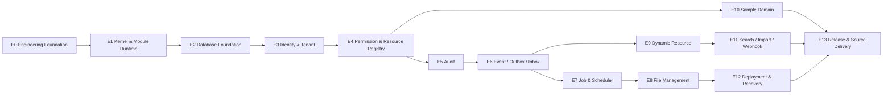

# Java Core Platform — Implementation Backlog

| Thuộc tính | Giá trị |
|---|---|
| Mã tài liệu | `CP-BACKLOG-006` |
| Phiên bản | `1.0.0` |
| Trạng thái | Approved Baseline |
| Nhịp triển khai | Sprint 2 tuần |
| Đội tham chiếu | 5 người hiện tại, 7 người sau 12 tháng |

## 1. Quy tắc sử dụng backlog

- Epic thực hiện theo dependency, không chỉ theo mức độ hấp dẫn.
- Story chỉ vào sprint khi đạt Definition of Ready.
- Mọi story phải có test evidence và documentation impact.
- Estimate do đội triển khai chốt sau technical spike; tài liệu không cam kết ngày hoàn thành.
- Không triển khai production capability khi chưa có owner vận hành.

## 2. Milestones

| Milestone | Kết quả |
|---|---|
| M0 | Build, test, local environment và quality gates chạy được |
| M1 | Kernel/module runtime và database bootstrap ổn định |
| M2 | Identity, tenant và permission bảo vệ end-to-end |
| M3 | Audit, outbox, inbox và job durability hoàn chỉnh |
| M4 | File, Dynamic Resource và sample Domain chứng minh Three-Plane |
| M5 | Deployment, recovery, source delivery và Release 1.0 |

## 3. Epic dependency

## 4. E0 — Engineering Foundation

**Outcome:** Mọi developer có thể clone, build, test và chạy local bằng quy trình giống nhau.

### E0-S01 — Repository và Maven build

- Tạo Maven Wrapper và root aggregator.
- Tạo Platform BOM.
- Tạo module skeleton theo TIS.
- Pin plugin/dependency versions.

**Acceptance:** `mvnw verify` chạy trên máy sạch; không dynamic dependency version.

### E0-S02 — CI baseline

- Compile, unit test, architecture test.
- Dependency/security scan.
- SBOM generation.
- Artifact retention.

**Acceptance:** Pull request bị chặn khi gate bắt buộc lỗi.

### E0-S03 — Local environment

- Docker Compose cho PostgreSQL và object-storage adapter.
- Sample config và secret template.
- One-command bootstrap.

**Acceptance:** Developer mới chạy được môi trường theo README, không cần secret dùng chung.

### E0-S04 — Code conventions

- Error envelope.
- Correlation ID.
- Clock/ID abstractions.
- Test fixture conventions.

**Acceptance:** Sample endpoint chứng minh conventions và test.

## 5. E1 — Kernel & Module Runtime

### E1-S01 — Module descriptor và discovery

- Parse packaged manifest.
- Validate name/version/Core compatibility.
- Tạo dependency DAG.

**Acceptance:** Missing dependency, duplicate capability và incompatible version làm startup fail.

### E1-S02 — Module boundary verification

- Spring Modulith verification.
- ArchUnit internal-package rule.
- Cấm cycle và controller→repository.

**Acceptance:** Intentional violation trong fixture làm test fail.

### E1-S03 — Registration lifecycle

- Register capability/resource/hook/job/handler.
- Deterministic ordering.
- Readiness state machine.

**Acceptance:** Module registration reproducible giữa hai lần startup.

### E1-S04 — Module migration coordinator

- Dependency-ordered migration.
- Deployment lock.
- Checksum and failure state.

**Acceptance:** Hai instance khởi động đồng thời không chạy migration xung đột.

## 6. E2 — Database Foundation

### E2-S01 — Schemas và database roles

- Tạo `cp_*` schemas.
- Tạo owner/migrator/app/worker/backup roles.
- Revoke default/public privileges.

**Acceptance:** Runtime credential không DDL, không owner và không BYPASSRLS.

### E2-S02 — Tenant transaction context

- Transaction interceptor dùng `SET LOCAL`/`set_config`.
- Fail closed khi thiếu tenant.
- Pool reset test.

**Acceptance:** Connection reuse không rò tenant context.

### E2-S03 — RLS policy template và test kit

- ENABLE/FORCE RLS migration helper.
- Negative-test base class.
- Policy coverage check trong CI.

**Acceptance:** Cross-tenant read/write/list/export fixture đều bị chặn.

### E2-S04 — Migration test harness

- Fresh install.
- Previous-version upgrade.
- Expand-contract fixture.

**Acceptance:** CI chạy cả fresh và upgrade path.

## 7. E3 — Local Identity & Tenant

### E3-S01 — Tenant và organization

- Tenant bootstrap.
- Organization hierarchy baseline.
- Administrative audit.

**Acceptance:** Không thể tạo/move organization xuyên tenant.

### E3-S02 — Account/password

- Account lifecycle.
- Argon2id policy/rehash.
- Lockout/reset flow.

**Acceptance:** Password không bao giờ lưu/log rõ; policy upgrade rehash thành công.

### E3-S03 — Session/refresh rotation

- Short-lived access credential.
- Opaque refresh credential hash.
- Family rotation/reuse detection/revocation.

**Acceptance:** Dùng lại refresh credential cũ revoke family và tạo security audit.

### E3-S04 — Administrator MFA

- MFA enrollment/verification/recovery.
- One-time recovery code hash.

**Acceptance:** Administrator production không đăng nhập nếu chưa đạt MFA policy.

### E3-S05 — Service account

- Scoped credential.
- Rotation, expiry, revoke và audit.

**Acceptance:** Service credential không được dùng như human admin session.

## 8. E4 — Permission & Resource Registry

### E4-S01 — Resource Registry

- `ResourceDescriptor` registration/version/drift hash.
- Owner/storage-mode/action validation.

**Acceptance:** Duplicate owner/type hoặc descriptor drift không được silently accept.

### E4-S02 — Role và binding

- Role/account-role/policy/binding.
- Tenant scope và active period.

**Acceptance:** Role change tăng permission revision.

### E4-S03 — PDP/PEP

- Typed authorization request/decision.
- Deny by default.
- Obligations/field masking.

**Acceptance:** Missing/broken policy trả Deny; controller annotation không phải protection duy nhất.

### E4-S04 — Permission query predicates

- Record ownership/organization scope.
- Query predicate integration.

**Acceptance:** List/search không đọc toàn bộ dữ liệu rồi lọc memory.

### E4-S05 — Classification gate

- Template và CI/document check cho DOMAIN/DYNAMIC decision.

**Acceptance:** Dynamic definition thiếu approved classification không activate.

## 9. E5 — Audit

### E5-S01 — Business audit transaction

- Audit writer.
- Masked change summary.
- Same-transaction failure behavior.

**Acceptance:** Audit insert failure làm critical business transaction rollback.

### E5-S02 — Security audit

- Login/deny/admin/policy/credential events.
- Safe IP/client metadata.

**Acceptance:** Không có secret/token/password trong audit.

### E5-S03 — Audit hash chain

- Canonical serialization.
- Batch sequence/hash.
- Verification command.

**Acceptance:** Sửa/xóa fixture event làm verification fail.

### E5-S04 — Checkpoint và retention

- Signed/external checkpoint adapter.
- Archive/legal hold/purge workflow.

**Acceptance:** Purge không vượt legal hold hoặc uncheckpointed batch.

## 10. E6 — Event, Outbox & Inbox

### E6-S01 — Integration event contract

- Envelope/version/schema validation.
- Domain-to-integration mapping.

**Acceptance:** Không serialize JPA entity; compatibility gate chạy CI.

### E6-S02 — Transactional outbox

- Same-transaction enqueue.
- Pending/lease/publish state.

**Acceptance:** Crash trước/sau commit không mất committed event.

### E6-S03 — Relay và retry

- Claim bằng lease/`SKIP LOCKED`.
- Backoff, transport acknowledgement và DEAD state.

**Acceptance:** Nhiều worker không xử lý đồng thời một lease; crash có thể duplicate nhưng không mất event.

### E6-S04 — Inbox/idempotent consumer

- Consumer-event unique claim.
- Side effect + completion consistency.

**Acceptance:** Gửi cùng event hai lần chỉ tạo một side effect.

### E6-S05 — DLQ/replay

- Operator resolution.
- Permission, reason và audit.

**Acceptance:** Replay không bypass idempotency ngoài approved procedure.

## 11. E7 — Job & Scheduler

### E7-S01 — Job queue

- Lifecycle, priority, schedule, payload/reference.
- Tenant context propagation.

**Acceptance:** Job thiếu tenant ở tenant-owned handler fail closed.

### E7-S02 — Worker lease/heartbeat

- Claim, heartbeat, expiry và recovery.

**Acceptance:** Kill worker giữa job; job được reclaim an toàn.

### E7-S03 — Retry/dead/cancel

- Error classification.
- Backoff+jitter.
- Safe cancellation/checkpoint.

**Acceptance:** Non-retryable lỗi không retry vô hạn.

### E7-S04 — Scheduler leader

- Trigger calculation/misfire.
- Distributed leader lease.

**Acceptance:** Hai scheduler chỉ tạo một logical scheduled job.

## 12. E8 — File Management

### E8-S01 — Upload session/staging

- Size/type/quota checks.
- Streaming upload, checksum và expiry.

**Acceptance:** Upload ngắt không tạo ACTIVE file; staging cleanup hoạt động.

### E8-S02 — Scan/finalization

- Scan adapter.
- Metadata/object finalization state machine.

**Acceptance:** File policy yêu cầu scan không ACTIVE trước kết quả sạch.

### E8-S03 — Attachment/download

- Resource link.
- Authorization và signed URL/stream.

**Acceptance:** Cross-tenant/file-ID guessing không tải được file.

### E8-S04 — Reconciliation/deletion

- Orphan/missing/checksum reconciliation.
- Retention/legal hold/purge.

**Acceptance:** Restore fixture phát hiện DB/object mismatch.

## 13. E9 — Dynamic Resource

### E9-S01 — Definition/version

- Resource/field definition.
- Compatibility and activation.

**Acceptance:** Breaking definition không activate nếu thiếu migration.

### E9-S02 — JSONB record store

- Common typed columns.
- Schema validation.
- Optimistic version/history.

**Acceptance:** Invalid payload và stale version bị chặn.

### E9-S03 — Generic CRUD/query

- API, pagination, allowlisted filter/sort.
- Permission/audit/outbox.

**Acceptance:** Generic endpoint từ chối DOMAIN descriptor.

### E9-S04 — Governed index compiler

- Allowlisted expression/partial index templates.
- Unique-field strategy.

**Acceptance:** Metadata không thể chèn raw SQL; index migration reproducible.

### E9-S05 — Custom fields

- Definition/validation/presentation.
- Domain `custom_attributes` adapter.

**Acceptance:** Custom field không override typed domain field/invariant.

## 14. E10 — Sample Domain Module

### E10-S01 — Typed aggregate

- Chọn neutral sample như `Case`/`ApprovalRequest`, không ERP-specific.
- Root/child, constraint, optimistic version.

**Acceptance:** Chứng minh code-first path không phụ thuộc Dynamic Resource.

### E10-S02 — Domain commands/events

- Create/transition/cancel command.
- Domain event → integration event.

**Acceptance:** Invalid transition bị domain invariant chặn.

### E10-S03 — Domain permissions/audit/custom field

**Acceptance:** Chứng minh Three-Plane integration end-to-end.

## 15. E11 — Search, Import/Export & Webhook

### E11-S01 — PostgreSQL search

- `tsvector`, GIN và `pg_trgm` khi cần.
- Policy-filtered projection.

**Acceptance:** Medium benchmark đạt target hoặc có ADR.

### E11-S02 — CSV import/export

- Background job, validation report, secure result file.

**Acceptance:** Large import retry không tạo duplicate.

### E11-S03 — Webhook

- Endpoint/secret reference/delivery/retry.
- SSRF protections.

**Acceptance:** Private/disallowed destination bị chặn theo network policy.

## 16. E12 — Deployment, Observability & Recovery

### E12-S01 — OCI image và profiles

- `api`, `worker`, `scheduler`, `migration`, `all-in-one`.

**Acceptance:** Cùng image chạy đúng từng profile.

### E12-S02 — Docker Compose Pilot

- Reverse proxy, app, DB, storage, backup.

**Acceptance:** Fresh VM deployment theo runbook.

### E12-S03 — Standard/Kubernetes profile

- Stateless API, workers, migration job, Helm.

**Acceptance:** Rolling deployment không chạy migration xung đột.

### E12-S04 — Observability

- Logs, metrics, traces, health and dashboards.

**Acceptance:** Outbox/job/DB/auth/file failure tạo signal có hành động.

### E12-S05 — Backup/restore drill

- PITR/backup, object reconciliation và recovery order.

**Acceptance:** Đạt service tier mục tiêu bằng drill có biên bản.

## 17. E13 — Release & Source Delivery

### E13-S01 — API/event compatibility

**Acceptance:** Breaking change bị CI chặn hoặc có major-version plan.

### E13-S02 — Performance baseline

**Acceptance:** Medium profile report có p95/p99, bottleneck và capacity limit.

### E13-S03 — Security review

**Acceptance:** Tenant/auth/permission/file/webhook threat cases được kiểm chứng.

### E13-S04 — Clean-room build/deploy

**Acceptance:** Nhóm độc lập build/test/deploy từ source package, không private dependency.

### E13-S05 — Release 1.0 package

**Acceptance:** Source, SBOM, migrations, tests, deployment assets, runbooks, tag/checksum và known limitations đầy đủ.

## 18. Recommended team ownership

| Stream | Primary | Reviewer |
|---|---|---|
| Kernel/module/build | Technical Lead | Developer A |
| Identity/security/permission | Developer A | Security Approver |
| Database/audit/event | Developer B | Technical Lead/Data Architect |
| Job/file/integration | Developer C | Developer B |
| Dynamic Resource/sample domain | Developer D | Technical Lead |
| QA/CI/recovery | QA/Platform owner | Toàn đội theo capability |

Nếu chưa tuyển DevOps, một người được chỉ định Platform Owner tạm thời nhưng production gate vẫn cần người đủ năng lực phê duyệt.

