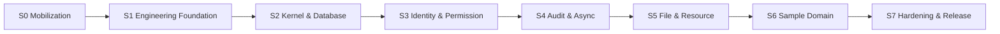

# Java Core Platform — Execution Start Plan

| Thuộc tính | Giá trị |
|---|---|
| Mã tài liệu | `CP-EXEC-008` |
| Phiên bản | `1.0.0` |
| Trạng thái | Ready to Execute |
| Nhịp làm việc | Sprint 2 tuần |
| Đội ban đầu | 5 người |
| Mục tiêu | Bắt đầu triển khai có kiểm soát, không tự suy diễn kiến trúc |

## 1. Kết quả cần đạt

Kế hoạch được chia thành tám stage. Mỗi stage chỉ kết thúc khi có artifact chạy được và evidence kiểm thử, không kết thúc chỉ vì đã viết xong code.



## 2. Phân công đội 5 người

Không cần chờ tuyển đủ 7 người mới bắt đầu. Trong giai đoạn đầu, một người có thể giữ nhiều vai trò nhưng quyền phê duyệt phải được ghi rõ.

| Vai trò | Trách nhiệm chính | Không được tự phê duyệt |
|---|---|---|
| Người 1 — Technical Lead | Kiến trúc, kernel, module boundary, review cuối | Thay đổi security/data critical do chính mình viết |
| Người 2 — Security/Identity Developer | Identity, tenant, permission, security tests | Security exception |
| Người 3 — Data/Async Developer | Migration, audit, outbox, inbox, job | Destructive migration production |
| Người 4 — Platform Feature Developer | File, Dynamic Resource, search/import/webhook | Dynamic classification exception |
| Người 5 — QA/Platform Owner tạm thời | CI/CD, test automation, Docker, observability, recovery | Production release một mình |

Khi tăng lên 7 người:

- Người 6: Domain/Integration Developer.
- Người 7: DevOps/Platform Engineer có kinh nghiệm production.

Nếu chưa tuyển được Security Lead/Data Architect, dùng reviewer tư vấn theo milestone thay vì bỏ gate.

## 3. Cơ chế quản trị công việc

### 3.1 Board

Tạo một board với các trạng thái:

```text
Backlog
→ Architecture Ready
→ Sprint Ready
→ In Progress
→ Code Review
→ Verification
→ Done
→ Released
```

Không chuyển ticket sang `Sprint Ready` nếu chưa đạt Definition of Ready.

### 3.2 Ticket template

Mỗi ticket phải có:

```text
Outcome:
Owner module:
Dependencies:
Architecture references:
Tenant/security impact:
Database/migration impact:
Transaction/failure behavior:
API/event impact:
Acceptance criteria:
Required tests:
Documentation impact:
Approver:
```

### 3.3 Working agreements

- Branch ngắn hạn, ưu tiên hoàn tất trong 1–3 ngày.
- Mọi thay đổi qua pull request.
- Ít nhất một reviewer; security/data critical cần reviewer đúng vai trò.
- Không merge khi CI bắt buộc lỗi.
- Không triển khai hai abstraction cạnh tranh cho cùng một capability.
- Không thêm dependency mới nếu chưa ghi lý do, license và operational impact.
- AI chỉ hỗ trợ tạo mã/test/tài liệu; tác giả PR chịu trách nhiệm hiểu toàn bộ thay đổi.

## 4. S0 — Mobilization, 2–3 ngày

### Mục tiêu

Biến tài liệu thành không gian làm việc chính thức trước khi viết Core.

### Công việc

1. Chỉ định tạm thời năm vai trò ở Mục 2.
2. Tạo repository canonical Core.
3. Đưa toàn bộ Technical Delivery Pack vào `docs/architecture/`.
4. Bật branch protection cho nhánh chính.
5. Tạo board, milestone và ticket templates.
6. Tạo ADR directory và numbering convention.
7. Tạo decision register cho dependency/version.
8. Thiết lập quy tắc source ownership và customer release snapshot.

### Artifact

- Repository tồn tại.
- `CODEOWNERS` hoặc cơ chế reviewer tương đương.
- PR/issue/ADR templates.
- Board có E0–E13 từ backlog.
- Danh sách approver tạm thời.

### Exit gate

- Không có developer nào phải hỏi source of truth nằm ở đâu.
- Mỗi Epic có owner.
- Nhánh chính không cho push trực tiếp.

## 5. S1 — Engineering Foundation, Sprint 1–2

### Sprint 1 — Build và local environment

#### Technical Lead

- Tạo Maven parent và module skeleton.
- Tạo `platform-bom`.
- Pin Java 21, Spring Boot 3.x exact version, Spring Modulith và test dependencies.
- Tạo package convention và sample module.

#### QA/Platform Owner

- Tạo Maven Wrapper.
- Tạo Docker Compose cho PostgreSQL và S3-compatible development storage.
- Tạo CI compile/unit-test baseline.
- Tạo secret/config templates.

#### Các developer còn lại

- Tạo error contract, correlation ID, Clock/ID abstractions.
- Tạo unit-test conventions và reusable fixtures.
- Viết getting-started guide và kiểm thử trên máy sạch.

### Sprint 1 deliverable

```text
clone
→ configure development secrets
→ docker compose up
→ mvnw verify
→ start application
→ health endpoint OK
```

### Sprint 2 — Quality gates

- Spring Modulith verification.
- ArchUnit rules.
- Static/dependency/security scan.
- SBOM generation.
- Testcontainers baseline.
- Clean-room build job.
- OCI image build.

### S1 exit gate

- `mvnw verify` xanh trên CI và máy sạch.
- Intentional module-boundary violation làm test fail.
- Không dynamic dependency version.
- OCI image chạy được bằng Docker Compose.
- SBOM được tạo tự động.

## 6. S2 — Kernel & Database Foundation, Sprint 3–5

### Sprint 3 — Module Runtime

- `ModuleDescriptor` và manifest parser.
- Packaged-module discovery.
- Core/module compatibility.
- Dependency DAG và cycle detection.
- Capability registration.
- Startup/readiness state machine.

### Sprint 4 — Database bootstrap

- Tạo `cp_*` schemas.
- Tạo database roles/GRANT.
- Flyway theo module/schema.
- Migration coordinator và deployment lock.
- Fresh-install/upgrade test harness.

### Sprint 5 — Tenant/RLS foundation

- Tenant transaction interceptor.
- `current_tenant_id()` database contract.
- RLS migration template.
- ENABLE + FORCE RLS verification.
- Cross-tenant negative-test base class.
- Connection-pool context leakage test.

### S2 exit gate

- Module dependency lỗi làm startup fail trước Ready.
- Hai instance không chạy migration xung đột.
- Runtime role không DDL/BYPASSRLS.
- Tenant A không thể đọc/ghi dữ liệu Tenant B bằng runtime credential.
- Fresh install và upgrade fixture cùng xanh.

## 7. S3 — Identity, Tenant & Permission, Sprint 6–8

### Sprint 6 — Local Identity

- Tenant/account lifecycle.
- Argon2id hash policy và rehash.
- Login/lockout/reset.
- Security audit baseline.

### Sprint 7 — Session và MFA

- Short-lived access credential.
- Refresh credential opaque/hash/rotation.
- Reuse detection và revoke family.
- Administrator MFA và recovery code.
- Service account scope/rotation.

### Sprint 8 — Permission và Resource Registry

- Role/account-role/policy/binding.
- Permission revision/cache invalidation.
- PDP/PEP, default Deny và obligations.
- Resource Registry/descriptor.
- Record/organization query predicate.
- DOMAIN/DYNAMIC classification gate.

### S3 exit gate

- Refresh token reuse được phát hiện và revoke.
- Admin production phải MFA.
- Missing/broken policy luôn Deny.
- Permission list query không lọc dữ liệu trong memory.
- Descriptor duplicate/drift bị chặn.

## 8. S4 — Audit, Event & Background Processing, Sprint 9–12

### Sprint 9 — Audit

- Business audit cùng transaction.
- Security audit.
- Masked change summary.
- Append-only role/GRANT.

### Sprint 10 — Tamper evidence

- Canonical audit serialization.
- Batch hash chain.
- Checkpoint adapter và verification command.
- Retention/legal-hold workflow.

### Sprint 11 — Outbox/Inbox

- Integration event envelope.
- Transactional outbox.
- Worker lease/claim/retry.
- Inbox/idempotent consumer.
- DEAD/DLQ và audited replay.

### Sprint 12 — Job/Scheduler

- Job lifecycle.
- Lease/heartbeat/checkpoint.
- Retry classification/backoff/jitter.
- Scheduler leader lease/misfire.
- Cancel/requeue operation.

### S4 exit gate

- Audit insert failure rollback critical transaction.
- Audit fixture tampering bị verification phát hiện.
- Crash injection không làm mất committed outbox event.
- Duplicate event/job không tạo side effect lần hai.
- Hai workers không chạy đồng thời cùng active lease.

## 9. S5 — File & Dynamic Resource, Sprint 13–16

### Sprint 13 — File upload/storage

- Upload session và staging.
- Streaming/checksum/type/quota.
- S3/filesystem adapter.
- Scan adapter contract.

### Sprint 14 — File access/reconciliation

- Finalization state machine.
- Resource link.
- Download authorization/signed URL.
- Orphan/missing/checksum reconciliation.
- Retention/legal hold/purge.

### Sprint 15 — Dynamic definition/store

- Resource/field definition và version.
- JSON schema validation.
- Shared JSONB record store.
- Optimistic lock/history.
- Compatibility and activation.

### Sprint 16 — Dynamic API/index/custom fields

- Generic CRUD/query.
- Permission/audit/outbox integration.
- Allowlisted filter/sort.
- Governed index compiler.
- Code-first custom-field adapter.

### S5 exit gate

- Upload ngắt không tạo ACTIVE file.
- Cross-tenant file access bị chặn.
- Restore mismatch được reconciliation phát hiện.
- Generic API từ chối DOMAIN descriptor.
- Breaking definition không activate khi thiếu migration.
- Metadata không thể tạo raw SQL.

## 10. S6 — Sample Domain & Supporting Modules, Sprint 17–19

### Sprint 17 — Code-first sample domain

- Neutral aggregate, root/child/constraint.
- Domain commands và transitions.
- Typed repository/migration.
- Domain event → integration event.

### Sprint 18 — Three-Plane proof

- Domain permission/audit/presentation descriptor.
- Custom field trên aggregate.
- End-to-end test chứng minh không đi qua Generic CRUD.

### Sprint 19 — Search/import/webhook

- PostgreSQL full-text search.
- CSV import/export background job.
- Webhook delivery/retry/SSRF guard.

### S6 exit gate

- Domain invariant được database + domain code bảo vệ phù hợp.
- Sample domain chạy độc lập khi Dynamic Resource bị disable.
- Search đạt baseline trên dataset đại diện.
- Import retry không tạo duplicate.
- Webhook disallowed destination bị chặn.

## 11. S7 — Hardening, Deployment & Release, Sprint 20–23

### Sprint 20 — Observability và failure injection

- Dashboards/alerts.
- DB/outbox/job/file/security metrics.
- Broker/storage/worker/permission failure tests.

### Sprint 21 — Deployment profiles

- Pilot Docker Compose.
- API/worker/scheduler/migration profiles.
- Standard rolling deployment.
- Helm chart cho Critical profile.

### Sprint 22 — Recovery và performance

- Backup/PITR/restore drill.
- Object/database reconciliation.
- Medium capacity benchmark.
- Query/index tuning có evidence.

### Sprint 23 — Release 1.0

- Security review.
- API/event compatibility report.
- N-1 migration test.
- Clean-room build/test/deploy.
- SBOM, source package và runbooks.
- Release approval.

### S7 exit gate

- Release 1.0 exit criteria trong TIS đạt.
- Service tier được chứng minh bằng drill, không chỉ khai báo.
- Customer source package không phụ thuộc private binary/repository.
- Known limitations được ghi rõ.

## 12. Lịch tổng thể tham chiếu

Nếu mỗi stage đạt ngay trong số sprint dự kiến:

| Stage | Sprint | Khoảng thời gian |
|---|---:|---:|
| S0 | Mobilization | 2–3 ngày |
| S1 | 1–2 | 4 tuần |
| S2 | 3–5 | 6 tuần |
| S3 | 6–8 | 6 tuần |
| S4 | 9–12 | 8 tuần |
| S5 | 13–16 | 8 tuần |
| S6 | 17–19 | 6 tuần |
| S7 | 20–23 | 8 tuần |

Tổng tham chiếu: khoảng 46–48 tuần với đội ban đầu. Đây là capacity plan, không phải cam kết thời hạn. Có thể rút ngắn khi tăng lên 7 người, nhưng không chạy song song công việc phá dependency.

## 13. Công việc bắt đầu ngay trong ngày đầu

### Technical Lead

1. Tạo canonical repository.
2. Chọn namespace Java chính thức.
3. Tạo Maven parent và `platform-bom` skeleton.
4. Đưa tài liệu vào repository.
5. Tạo architecture test module.

### Security/Identity Developer

1. Tạo threat-case backlog cho tenant/login/session.
2. Tạo identity schema draft từ `CP-DATA-003`.
3. Tạo password/session test cases trước implementation.

### Data/Async Developer

1. Tạo PostgreSQL schema/role bootstrap skeleton.
2. Tạo Flyway module convention.
3. Tạo migration fresh/upgrade test skeleton.

### Platform Feature Developer

1. Tạo standard-module skeleton.
2. Tạo `ResourceDescriptor` model spike.
3. Tạo Dynamic Resource classification examples: một trường hợp đạt, một trường hợp bị từ chối.

### QA/Platform Owner

1. Tạo CI pipeline skeleton.
2. Tạo Docker Compose development environment.
3. Tạo Testcontainers base fixture.
4. Tạo clean-room build job.
5. Tạo quality dashboard/checklist.

## 14. Kết quả bắt buộc cuối tuần đầu

- Repository và branch protection hoạt động.
- Maven Wrapper chạy.
- Java 21 build xanh.
- Platform BOM pin dependency versions.
- PostgreSQL development container chạy.
- Spring Boot skeleton có liveness/readiness endpoint.
- CI compile + unit test chạy trên mọi PR.
- Module/package skeleton tồn tại.
- ADR/PR/ticket templates sẵn sàng.
- Không có secret commit vào source.
- Một developer khác clean-clone và chạy được hướng dẫn.

## 15. Rủi ro cần theo dõi hàng tuần

| Rủi ro | Chỉ báo sớm | Hành động |
|---|---|---|
| Kernel phình thành business framework | Domain type xuất hiện trong kernel | Reject PR, chuyển về domain module |
| Dynamic Resource bị lạm dụng | Entity critical xin dùng generic CRUD | Classification gate + Technical Lead review |
| Đội bỏ qua RLS | Test chỉ chạy bằng owner/admin role | Bắt buộc runtime-role negative tests |
| Quá nhiều hạ tầng | Redis/Kafka/search thêm trước use case | Yêu cầu benchmark/ADR |
| AI tạo abstraction dư thừa | Nhiều layer/interface không có consumer | Complexity review và xóa |
| Migration nguy hiểm | DDL lock/backfill lớn trong một bước | Expand-contract và dry run |
| Không có người vận hành | Không ai sở hữu alert/restore | Tuyển/thuê Platform Engineer trước production |
| Chuyển giao không build được | Private package xuất hiện | Clean-room CI trên mỗi release candidate |

## 16. Báo cáo sprint

Mỗi sprint review phải cung cấp:

```text
Completed outcomes:
Acceptance evidence:
Architecture deviations/ADRs:
Security/data findings:
Migration impact:
Performance/reliability observations:
Known debt with owner/date:
Next sprint dependency readiness:
```

Không báo cáo chỉ bằng số ticket hoặc phần trăm hoàn thành.

